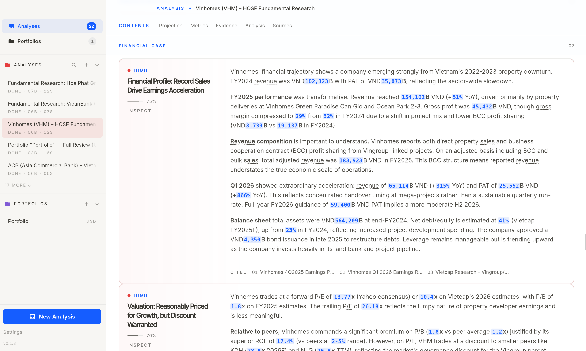
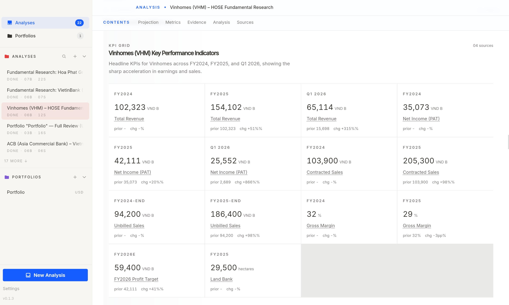
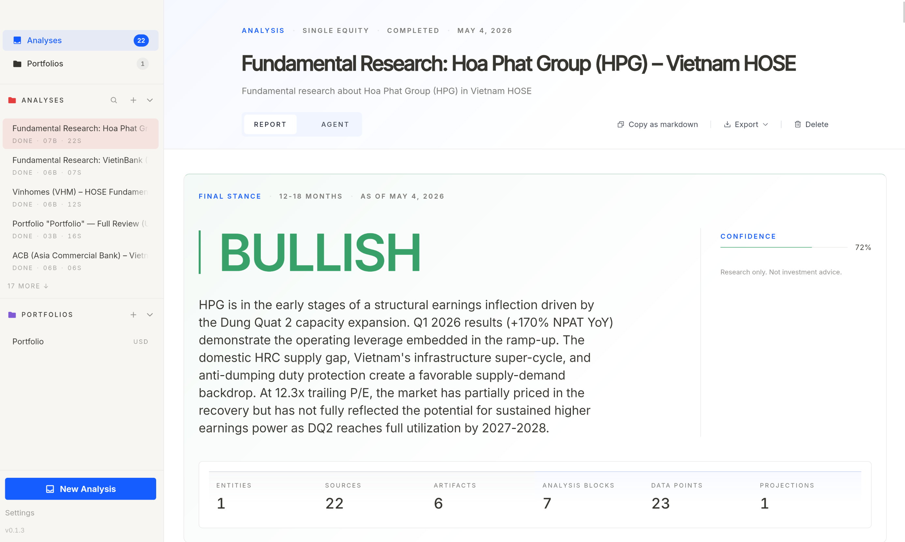
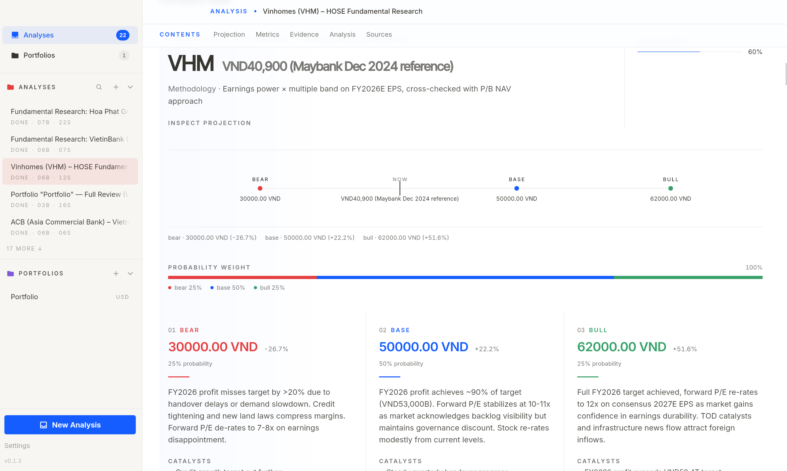
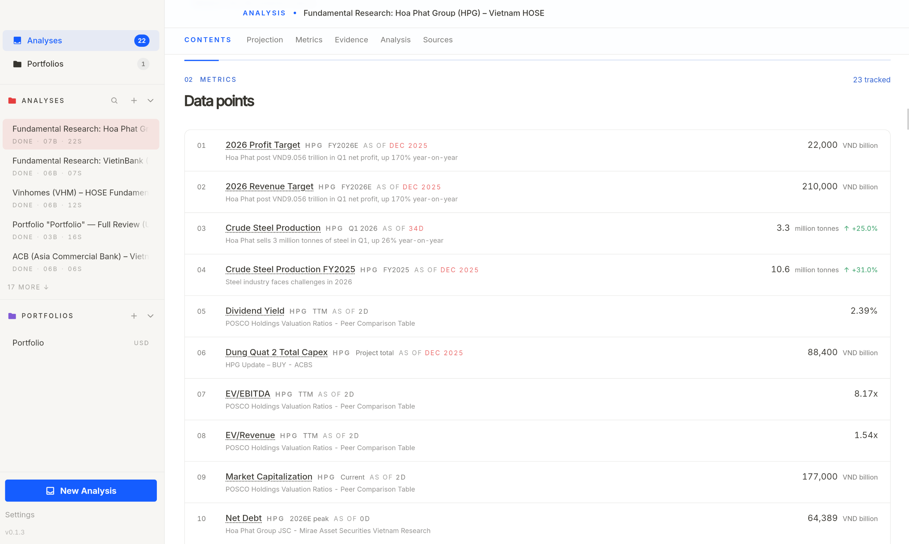
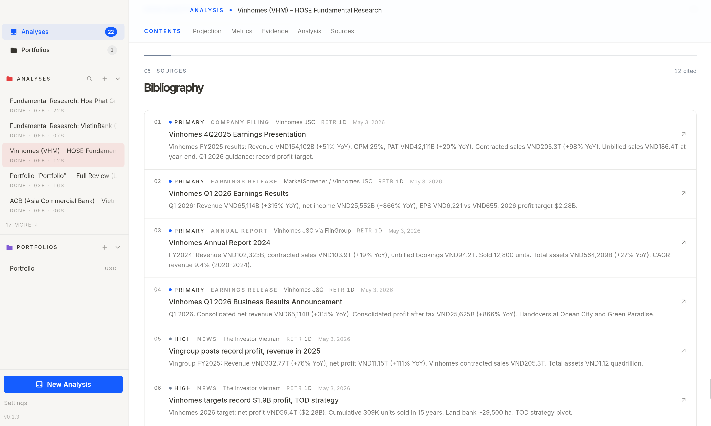
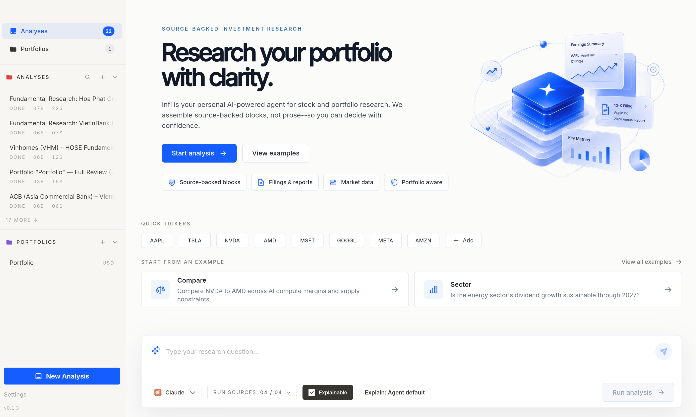
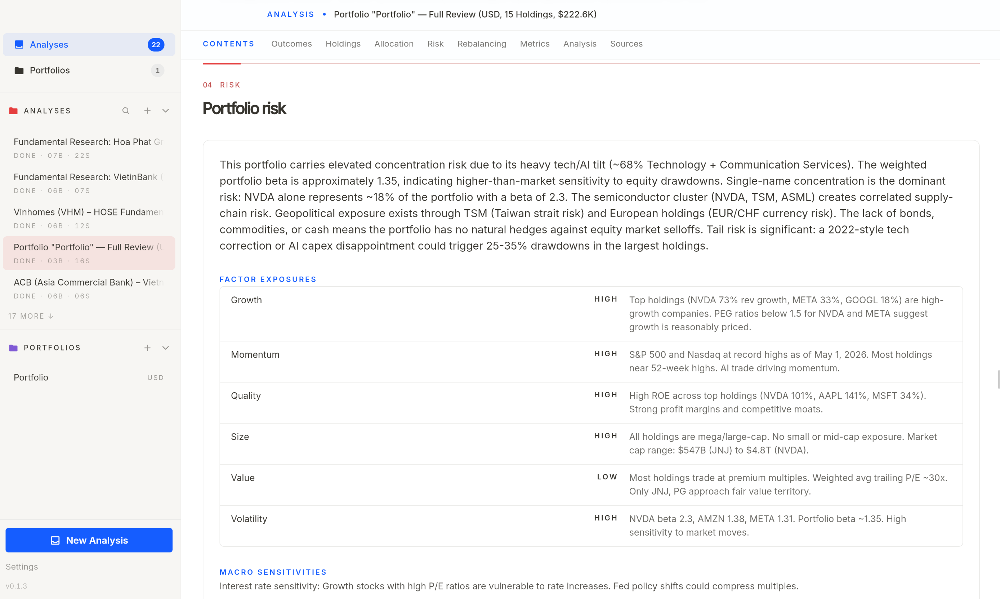

<p align="center">
  <a href="https://infi.sh">
    <picture>
      
    </picture>
  </a>
</p>

<h1 align="center">Infi</h1>

<p align="center">
  <b>AI-powered stock and portfolio research.</b><br>
  <sub>Source-backed claims. Structured reports. No black boxes.</sub>
</p>

<p align="center">
  <a href="https://github.com/khanhthanhdev/infi/actions/workflows/rust-ci.yml"></a>
  <a href="https://github.com/khanhthanhdev/infi/releases"></a>
  <a href="LICENSE-MIT"></a>
</p>

---

## What is Infi?

Infi is a desktop app that lets you research stocks and portfolios using AI coding agents. The agent fetches data, structures every claim as a source-backed block, and submits it through Infi's tools — the report is assembled from those typed blocks, never parsed from free-form prose.

Every analysis includes a thesis, risks, scenarios, and a final stance — all citing their sources.

<p align="center">
  <a href="assets/screenshots/analysis-thesis.png">
    
  </a>
</p>

## Core Features

**Structured Research**
- Thesis and risk blocks with source citations
- Scenario analysis (base, upside, downside)
- Final stance with confidence level and rationale
- Projections with bull/base/bear price targets

**Portfolio Analysis**
- CSV import for holdings and transactions
- Allocation review across asset class, sector, geography
- Risk assessment: factor exposures, macro sensitivities, tail risks
- Rebalancing suggestions with scenario comparisons
- Portfolio-level expected return modelling

**12 Data Providers**
- Tavily, Brave Search, SEC EDGAR, Alpha Vantage, Financial Modeling Prep
- Finnhub, Polygon, Yahoo Finance, NewsAPI, Finviz, StockTwits, Hacker News
- API keys stored in your OS keychain; providers without keys are excluded

**Export & Share**
- Standalone HTML export (interactive viewer)
- Markdown export
- Publish to PageDrop.io with a shareable link

**Privacy-First**
- Local SQLite storage — no cloud, no account, no telemetry
- API keys never leave your machine

## Screenshots

<table>
  <tr>
    <td align="center">
      <a href="assets/screenshots/analysis-thesis.png">
        
      </a>
      <br><sub>Thesis & Risks</sub>
    </td>
    <td align="center">
      <a href="assets/screenshots/analysis-scenario-matrix.png">
        
      </a>
      <br><sub>Scenario Matrix</sub>
    </td>
  </tr>
  <tr>
    <td align="center">
      <a href="assets/screenshots/analysis-final-stance.png">
        
      </a>
      <br><sub>Final Stance</sub>
    </td>
    <td align="center">
      <a href="assets/screenshots/analysis-projection.png">
        
      </a>
      <br><sub>Projections</sub>
    </td>
  </tr>
  <tr>
    <td align="center">
      <a href="assets/screenshots/analysis-data-points.png">
        
      </a>
      <br><sub>Data Points</sub>
    </td>
    <td align="center">
      <a href="assets/screenshots/analysis-sources.png">
        
      </a>
      <br><sub>Sources</sub>
    </td>
  </tr>
  <tr>
    <td align="center">
      <a href="assets/screenshots/new-analysis.png">
        
      </a>
      <br><sub>New Analysis</sub>
    </td>
    <td align="center">
      <a href="assets/screenshots/portfolio-risk.png">
        
      </a>
      <br><sub>Portfolio Risk</sub>
    </td>
  </tr>
</table>

## Supported Agents

Infi works with multiple AI coding agents via the Agent Client Protocol (ACP):

| <br>Claude | <br>Codex | <br>Gemini | <br>Kimi | <br>Mistral | <br>OpenCode | <br>Qwen |
| :---: | :---: | :---: | :---: | :---: | :---: | :---: |

You can also use any custom agent via `INFI_CUSTOM_AGENT` and `INFI_CUSTOM_AGENT_ARGS`.

## Installation

### Homebrew (macOS)

```bash
brew install --cask khanhthanhdev/tap/infi
```

### Windows / Linux

Download the latest installer from [GitHub Releases](https://github.com/khanhthanhdev/infi/releases).

### From Source

```bash
git clone https://github.com/khanhthanhdev/infi.git
cd infi
cargo run
```

> Requires Rust (stable toolchain) and [Bun](https://bun.sh) for the frontend build.

## Development Setup

### Prerequisites

- **Rust** — stable toolchain (managed via `rust-toolchain.toml` with `rustfmt` and `clippy`)
- **[Bun](https://bun.sh)** — frontend package manager and runner

### Quick Start

```bash
# 1. Clone the repo
git clone https://github.com/khanhthanhdev/infi.git
cd infi

# 2. Install frontend dependencies
cd frontend && bun install

# 3. Start the frontend dev server (hot reload)
bun run dev

# 4. In a separate terminal, run the Tauri app
cd ..
cargo run
```

### Frontend Commands

| Command | Description |
|---|---|
| `cd frontend && bun install` | Install frontend dependencies |
| `cd frontend && bun run dev` | Start Vite dev server with hot reload |
| `cd frontend && bun run build` | Type-check and build for production |
| `cd frontend && bun run build:viewer` | Build standalone HTML viewer (for export) |
| `cd frontend && bun run check:ci` | Biome lint + format check (zero warnings) |

### Rust Commands

| Command | Description |
|---|---|
| `cargo run` | Run the Tauri desktop app |
| `cargo check` | Validate compilation |
| `cargo test` | Run all tests |
| `cargo fmt` | Format code with rustfmt |
| `cargo clippy --all-targets --all-features -- -D warnings` | Lint (warnings = errors) |

### CI Validation

All checks must pass with **zero warnings** before committing:

```bash
cd frontend && bun run check:ci   # Biome lint + format
cd frontend && bun run build      # TypeScript type-check
cargo fmt --check                 # Rust formatting
cargo clippy --all-targets --all-features -- -D warnings  # Rust lint
cargo test                        # All tests
```

## Environment Variables

| Variable | Purpose |
|---|---|
| `INFI_DB_PATH` | Override SQLite database path |
| `INFI_CONFIG_PATH` | Override app config path |
| `INFI_MAX_METRIC_AGE_DAYS` | Data freshness cap (default: 365) |
| `INFI_CUSTOM_AGENT` | Custom ACP agent binary |
| `INFI_CUSTOM_AGENT_ARGS` | Arguments for custom agent |
| `INFI_SRC_KEY_<PROVIDER>` | Data source API key (e.g., `INFI_SRC_KEY_ALPHA_VANTAGE`) |

See [docs/ARCHITECTURE.md](docs/ARCHITECTURE.md) for the full technical deep-dive.

## License

MIT or Apache-2.0, at your option.

---

<p align="center"><sub>Research tool. Does not execute trades or provide investment advice.</sub></p>
