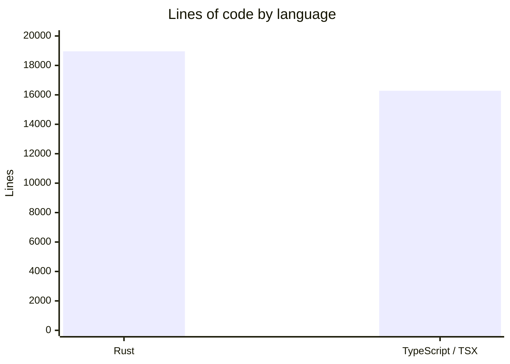
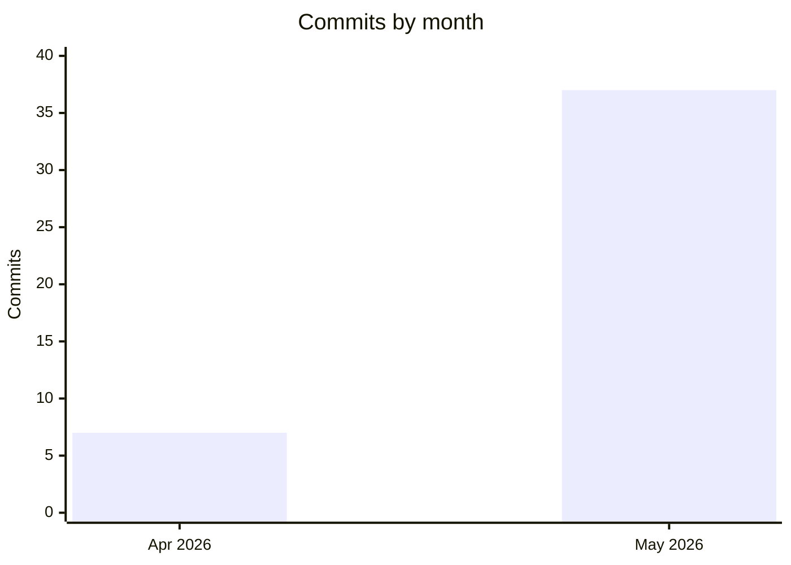

# By the Numbers

A quantitative snapshot of the Infi codebase.

## Language Breakdown

| Language | Source files | Lines of code |
|---|---|---|
| Rust | 44 | 18,961 |
| TypeScript / TSX | 92 (62 TSX + 30 TS) | 16,277 |
| **Total** | **136** | **35,238** |

## Activity

- **Total commits**: 44
- **Active period**: Apr 29 – May 25, 2026 (~4 weeks)
- **Tagged releases**: 7 (`v0.1.0` through `v0.1.6`)
- **Bot co-authored commits**: 3 (with Claude Opus, found in commit body trailers)

## Largest Source Files

### Rust

| File | Lines | Bytes |
|---|---|---|
| `src/infra/db/mod.rs` | 5,267 | 210,859 |
| `src/infra/acp/analysis_mcp_server/tool.rs` | 3,156 | 134,329 |
| `src/commands/mod.rs` | 1,941 | 67,756 |
| `src/domain/analysis.rs` | 1,157 | 32,763 |
| `src/prompts.rs` | 922 | 34,608 |
| `src/infra/acp/analysis_generator/client.rs` | 865 | 33,589 |
| `src/infra/acp/agent_discovery.rs` | 752 | 21,232 |
| `src/infra/acp/analysis_generator/worker.rs` | 480 | 16,390 |
| `src/infra/csv_parser.rs` | 426 | 13,566 |

### Frontend (TypeScript / TSX)

| File | Lines | Bytes |
|---|---|---|
| `frontend/src/lib/phosphor-icons.tsx` | 1,577 | 26,693 |
| `frontend/src/features/report-viewer/ReportContent.tsx` | 1,100 | 41,861 |
| `frontend/src/features/portfolio/PortfolioPage.tsx` | 1,011 | 35,795 |
| `frontend/src/types/index.ts` | 766 | 17,038 |
| `frontend/src/components/ui/sidebar.tsx` | 694 | 21,737 |
| `frontend/src/features/report-viewer/StructuredArtifactView.tsx` | 651 | 23,691 |
| `frontend/src/features/report-viewer/ProjectionView.tsx` | 579 | 19,034 |
| `frontend/src/app/AppSidebar.tsx` | 576 | 18,783 |
| `frontend/src/features/analysis/AnalysisPage.tsx` | 401 | 15,131 |

## Tests

- **Rust test functions**: 147 across 17 source files (heaviest: `src/infra/db/mod.rs` with 39)
- **Frontend test files**: 3 (Vitest with happy-dom)

---

*Data collected on 2026-06-01.*
