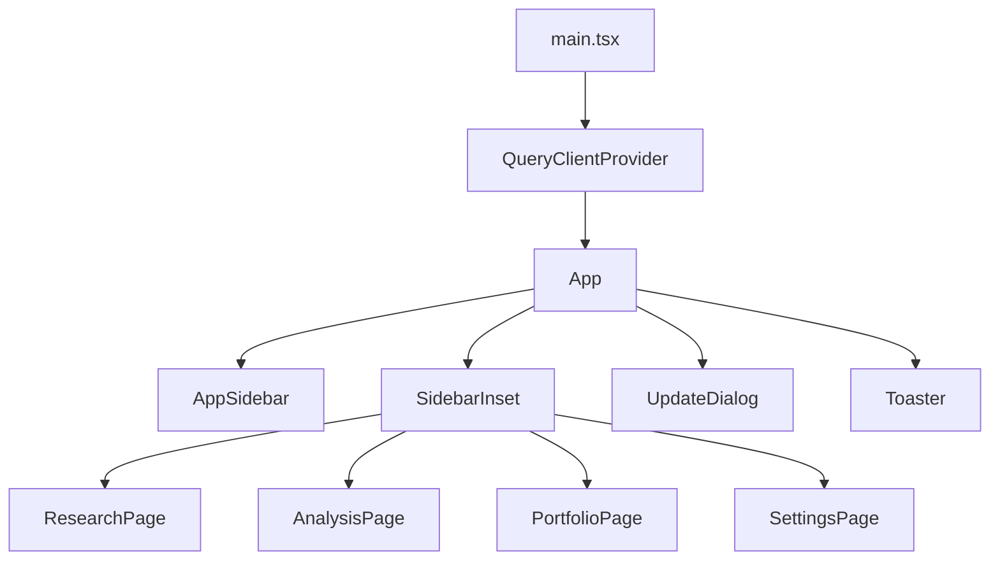
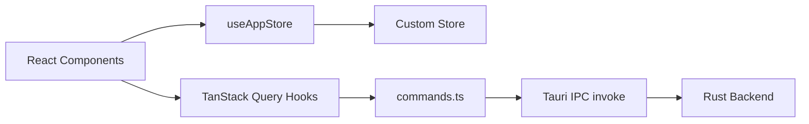

# Frontend Architecture

Infi's frontend is a React 19 single-page application built with Vite 8, TypeScript, and Tailwind CSS 4. It runs inside a Tauri 2 WebView and communicates with the Rust backend through Tauri IPC commands.

## Application Shell

The entry point is `frontend/src/main.tsx`, which mounts the root `<App />` component inside a `QueryClientProvider` (TanStack Query) and `React.StrictMode`.

`frontend/src/app/App.tsx` is the top-level orchestrator. It:

1. Subscribes to the global store via `useAppStore` to read the current view, selected analysis/portfolio, and agent state.
2. Fetches server-side lists (`useAgents`, `useAnalyses`, `usePortfolios`, `useSettings`) through TanStack Query hooks.
3. Renders the `AppSidebar` and a `SidebarInset` area that conditionally mounts one of four view components based on the `view` state.
4. Registers global keyboard shortcuts (`Cmd+Shift+A` for new analysis, `Cmd+Shift+P` for new portfolio).
5. Handles update notifications via `useUpdateCheck` and a `Toaster` (sonner).



## Navigation Model

Navigation is driven by the `AppView` type defined in `frontend/src/app/navigation.ts`:

```typescript
type AppView = "new-analysis" | "analysis" | "portfolio" | "settings";
```

The default view is `"new-analysis"`. View transitions happen through `setState({ view: nextView })` calls. When a user selects an analysis or portfolio from the sidebar, the app fetches the full detail (report or portfolio) and switches to the corresponding view.

| View | Component | Purpose |
|------|-----------|---------|
| `new-analysis` | `ResearchPage` | Compose and launch a new research query |
| `analysis` | `AnalysisPage` | Display agent progress and the finished report |
| `portfolio` | `PortfolioPage` | Manage holdings and run portfolio-level research |
| `settings` | `SettingsPage` | Configure agents, data sources, and preferences |

## State Management

The app uses a custom store built on React's `useSyncExternalStore` — no Redux, Zustand, or Jotai. The store lives in `frontend/src/store/index.ts`.

### Store Shape

The `State` interface holds:

- `view` — current navigation target
- `selectedAnalysisId` / `selectedReport` — active analysis and its loaded report
- `selectedPortfolioId` / `selectedPortfolio` — active portfolio and its loaded detail
- `agentId` — currently selected ACP agent
- `modelByAgent` — per-agent model override map (persisted to backend)
- `activeRuns` — map of `RunState` objects for in-flight analysis runs
- `activeAnalysisId` / `selectedRunTab` / `analysisSubTab` — UI state for the analysis view

### Store API

| Function | Purpose |
|----------|---------|
| `setState(partial)` | Merge partial state and notify subscribers |
| `useAppStore(selector)` | Subscribe to state with a selector (hooks-based) |
| `getState()` | Read current state synchronously (non-reactive) |
| `addRun(runState)` | Register a new active run |
| `updateRunStatus(runId, status)` | Update a run's lifecycle status |
| `addRunProgress(runId, type, message, data?)` | Append a progress event to a run |
| `appendRunProgress(runId, type, delta)` | Append text to the last progress item of matching type (for streaming deltas) |
| `setRunPlan(runId, plan)` | Replace a run's research plan |
| `setSelectedReport(next)` | Set the report with structural stability (avoids re-renders when content is identical) |

The `stableMerge` helper performs deep structural comparison so that `setSelectedReport` only triggers re-renders when the report data actually changes.

### TanStack Query for Server State

Server-side data (agents, analyses, portfolios, settings, sources) is fetched through TanStack Query hooks defined in `frontend/src/shared/api/queries.ts`. Query keys are centralized in `queryKeys`. Mutations (create, delete, rename, import CSV, update settings, manage source keys) automatically invalidate related queries on success.

The Tauri IPC layer lives in `frontend/src/shared/api/commands.ts` — each function wraps `invoke()` from `@tauri-apps/api/core`.



## Editorial Design System

The frontend follows an editorial design language — clean typography, hairline borders, zero radius, no shadows. The system is codified in `frontend/src/components/ui/editorial.tsx` and the global stylesheet `frontend/src/styles.css`.

### UI Primitives

All imported from `@/components/ui/editorial`:

| Component | Purpose |
|-----------|---------|
| `Eyebrow` | Uppercase 10.5px label with `tracking-[0.18em]`, muted foreground |
| `SectionHeader` | Numbered section header with eyebrow label, optional title and meta |
| `HairlineDivider` | 1px `bg-border` horizontal rule |
| `Dot` | Tiny 4px rounded dot, used as visual separators |
| `FreshnessChip` | Color-graded age label for data freshness (fresh/aging/stale/very_stale) |

### Styling Approach

- **Tailwind CSS 4** with `@tailwindcss/vite` plugin. The theme is defined via CSS custom properties in `styles.css`.
- **Zero radius** is authoritative (`--radius: 0px`). Components use `rounded-[6px]` or `rounded-[10px]` selectively.
- **Hairlines, not shadows**: section breaks use `border-t border-border`; lists use `divide-y divide-border`. No `shadow-sm`/`shadow-md` on cards or buttons.
- **Typography scale**: display headlines at 34–84px with `tracking-[-0.02em]`; body prose at 14–15.5px constrained to `max-w-[62ch]`.
- **Numbers**: always `tabular-nums`, zero-padded with `String(n).padStart(2, "0")`.
- **Color restraint**: one stance-derived accent per report page. `text-primary` reserved for actively running states.
- **Actions**: primary = solid foreground with hover inversion; secondary = text-style icon + label in muted foreground.

### Report Surfaces (Exception)

`ProgressTimeline`, `AgentTimeline`, `ToolCallCard`, and `MarkdownMessage` are log/terminal surfaces with a monospace, chat-style identity. They are deliberately outside the editorial grammar.

## Build System

### Main App Build

`frontend/vite.config.ts` configures the primary Vite build:

- Plugins: `@vitejs/plugin-react`, `@tailwindcss/vite`
- Build target: `chrome105` on Windows (Edge WebView2), `safari15` on macOS/Linux (WebKit)
- Manual chunks: `vendor-tauri`, `vendor-query`, `vendor-radix`, `vendor-icons`, `vendor-motion`, `vendor-markdown`, `vendor-react`
- Dev server on port 5173

### Viewer Build

`frontend/vite.viewer.config.ts` builds a self-contained HTML file for report export:

- Uses `vite-plugin-singlefile` to inline all JS/CSS
- Input: `frontend/viewer.html`
- Output: `frontend/dist-viewer/`
- The Rust `export_analysis_html` command substitutes report JSON at export time

## Key Source Files

| File | Purpose |
|------|---------|
| `frontend/src/main.tsx` | Application entry point |
| `frontend/src/app/App.tsx` | Root component, view routing, global effects |
| `frontend/src/app/AppSidebar.tsx` | Sidebar navigation with analyses and portfolios |
| `frontend/src/app/navigation.ts` | `AppView` type definition |
| `frontend/src/store/index.ts` | Custom `useSyncExternalStore` store |
| `frontend/src/shared/api/commands.ts` | Tauri IPC command wrappers |
| `frontend/src/shared/api/queries.ts` | TanStack Query hooks and mutation helpers |
| `frontend/src/shared/api/query-client.ts` | QueryClient configuration |
| `frontend/src/components/ui/editorial.tsx` | Editorial design primitives |
| `frontend/src/styles.css` | Global CSS with Tailwind theme variables |
| `frontend/vite.config.ts` | Main Vite build configuration |
| `frontend/vite.viewer.config.ts` | Self-contained viewer build configuration |

## Related Pages

- [Report Viewer](report-viewer.md) — how reports are rendered using the editorial design system
- [Run Analysis](run-analysis.md) — the research composition and agent progress flow
- [Portfolio](portfolio.md) — portfolio management and holdings
- [Settings](settings.md) — agent and data source configuration
