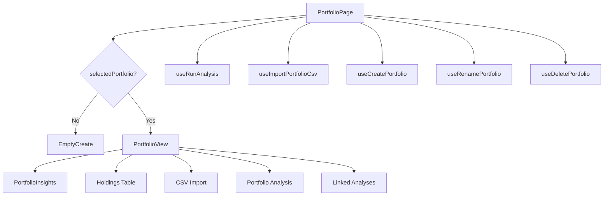
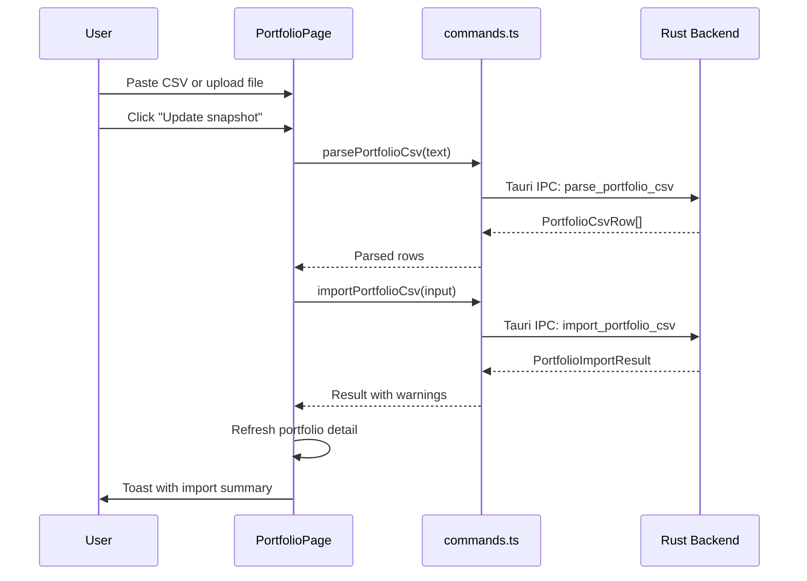

# Portfolio

The portfolio feature manages investment holdings, supports CSV import, and enables portfolio-level research. It lives in `frontend/src/features/portfolio/` (3 files).

## Architecture Overview

## PortfolioPage

`frontend/src/features/portfolio/PortfolioPage.tsx` (1012 lines) is the main portfolio management page. It renders one of two states:

### Empty Create State

When no portfolio is selected, the page shows a creation screen with:

- A hero section with title "Create a portfolio." and description.
- A **base currency selector** (USD, EUR, GBP, CHF, JPY, CAD, AUD, SEK, NOK, VND).
- A "Create a portfolio" button that calls `createPortfolio` via Tauri IPC.
- Feature badges: Portfolio tracking, Holdings snapshot.

### Portfolio View State

When a portfolio is selected, `PortfolioView` renders:

1. **Header** — editable portfolio name (click to rename, Enter to commit, Escape to cancel), base currency, last import date, and a dropdown menu with rename/delete options.
2. **Snapshot import area** — a textarea for pasting CSV data plus a file upload button. The "Update snapshot" button parses the CSV via `parsePortfolioCsv()` and imports it via `importPortfolioCsv()`.
3. **PortfolioInsights** — computed portfolio-level metrics.
4. **Holdings table** — a detailed table of all positions.
5. **Portfolio analysis** — a "Run portfolio analysis" button that creates a portfolio-scoped analysis and launches an agent run.
6. **Linked analyses** — previous analyses created from this portfolio.

### CSV Import Flow

The `PortfolioCsvImportInput` includes the portfolio ID, account info, base currency, import kind (`positions` or `transactions`), and the parsed rows. The backend returns an `PortfolioImportResult` with `imported_count`, `review_count`, and `warnings` for rows that need manual review.

### Portfolio Analysis Flow

When the user clicks "Run portfolio analysis":

1. Picks an agent and optional model override from a dropdown.
2. Calls `createPortfolioAnalysis(portfolioId, null)` to create an analysis scoped to the portfolio.
3. Calls `startWithAnalysisId()` from `useRunAnalysis` to launch the agent.
4. The agent receives the portfolio context and generates portfolio-specific report sections (holding reviews, allocation, risk, rebalancing).

## PortfolioInsights

`frontend/src/features/portfolio/PortfolioInsights.tsx` computes and displays portfolio-level metrics in a grid of cards:

| Metric | Key | Description |
|--------|-----|-------------|
| Positions | `portfolio:position_count` | Total number of holdings |
| Top 5 weight | `portfolio:concentration_top5` | Combined weight of 5 largest positions (emphasized if >70%) |
| Top 3 weight | `portfolio:concentration_top3` | Combined weight of 3 largest positions |
| Largest position | `portfolio:largest_position` | Weight of single largest holding (emphasized if >15%) |
| Currencies | `portfolio:currency_exposure` | Number of distinct currencies |
| Markets | `portfolio:market_exposure` | Number of distinct markets (if market data available) |
| Unrealized P/L | `portfolio:unrealized_pnl` | Gain/loss from cost basis (emphasized if <-10%) |

Each metric card supports metric explanation tooltips. The explanations are generated by `getPortfolioExplanations()`.

## Portfolio Explanations

`frontend/src/features/portfolio/portfolio-explanations.ts` generates static `MetricExplanation` objects for portfolio metrics. It provides:

### Holdings Table Column Explanations

| Column | Explanation |
|--------|-------------|
| Portfolio Weight | Percentage of total portfolio value; warns if single position >10-15% |
| Market Value | Current total value (quantity × price) |
| Quantity | Number of shares/units owned |
| Price | Last known market price per unit |
| 30-Day Price Change | Recent price momentum |

### Portfolio-Level Metric Explanations

| Metric | Definition | Good Threshold |
|--------|-----------|----------------|
| Concentration (Top 5) | Combined weight of 5 largest holdings | <50% diversified, 50-70% moderate, >70% concentrated |
| Concentration (Top 3) | Combined weight of 3 largest holdings | <35% diversified, 35-55% moderate, >55% concentrated |
| Largest Position | Weight of single largest holding | <5% conservative, 5-10% common, >15% high conviction |
| Position Count | Total distinct holdings | 1-10 concentrated, 15-30 typical active, 50+ index-like |
| Currency Exposures | Distinct currencies across holdings | Single = simple, multi = diversification + FX risk |
| Unrealized P/L | Gain/loss from cost basis | Context-dependent |

The `computePortfolioSummary()` function calculates derived values (top-5 weight, largest weight, unrealized P/L, etc.) from the raw holdings array.

## Backend Relationship

The portfolio frontend communicates with `src/domain/portfolio.rs` and `src/infra/db/` through Tauri IPC commands:

| Command | Purpose |
|---------|---------|
| `create_portfolio` | Create a new portfolio with name and base currency |
| `get_portfolios` | List all portfolio summaries |
| `get_portfolio_detail` | Get full portfolio with holdings, positions, transactions |
| `import_portfolio_csv` | Import CSV data into a portfolio |
| `parse_portfolio_csv` | Parse CSV text into structured rows (client-side preview) |
| `rename_portfolio` | Update portfolio name |
| `delete_portfolio` | Remove portfolio and all associated data |
| `create_analysis` | Create a portfolio-scoped analysis (with `portfolioId` parameter) |

## Key Source Files

| File | Lines | Purpose |
|------|-------|---------|
| `frontend/src/features/portfolio/PortfolioPage.tsx` | 1012 | Main portfolio management page |
| `frontend/src/features/portfolio/PortfolioInsights.tsx` | 118 | Portfolio-level metrics display |
| `frontend/src/features/portfolio/portfolio-explanations.ts` | 286 | Static metric explanations for portfolio metrics |

## Related Pages

- [Frontend Architecture](frontend-architecture.md) — state management and navigation
- [Report Viewer](report-viewer.md) — portfolio-specific report sections (holdings, allocation, risk, rebalancing)
- [Run Analysis](run-analysis.md) — the analysis execution flow used by portfolio analysis
- [Settings](settings.md) — data source configuration that affects portfolio analysis
