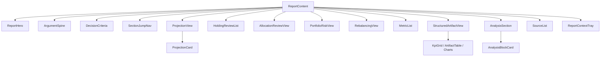

# Report Viewer

The report viewer renders completed analysis reports in a structured, editorial layout. It lives in `frontend/src/features/report-viewer/` (20 files) and is the primary surface for consuming research output.

## Architecture Overview

The report viewer follows a top-down composition pattern. `ReportContent` is the orchestrator that reads the selected report from the global store and renders sections conditionally based on available data.



## ReportContent

`frontend/src/features/report-viewer/ReportContent.tsx` (1101 lines) is the main rendering component. It:

1. Reads `selectedReport` and `selectedAnalysisId` from the global store.
2. Builds lookup maps (`sourceMap`, `entityMap`) for O(1) access by ID.
3. Computes section flags (`hasProjections`, `hasMetrics`, `hasEvidence`, etc.) to conditionally render sections.
4. Renders a two-column layout on wide screens: the report content on the left, and a `ReportContextTray` sidebar on the right (320px) showing details of the currently selected item.
5. Supports run switching — when multiple runs exist, the user can switch between them via `setActiveRun`.
6. For portfolio-intent reports, renders additional sections: holding reviews, allocation reviews, portfolio risk, rebalancing suggestions, and portfolio outcomes.

### Section Rendering Order

The report renders sections in a fixed order, each gated by a flag:

1. **ReportHero** — always rendered
2. **StaleStanceBanner** — warns if stance data is stale
3. **ArgumentSpine** — key reasons and counterarguments
4. **DecisionCriteria** — from the research plan
5. **SectionJumpNav** — sticky navigation links
6. **Portfolio Outcomes** — scenario analyses and expected return models (portfolio only)
7. **Projections** — forward-looking price/target projections
8. **Holding Reviews** — position-by-position analysis (portfolio only)
9. **Allocation Reviews** — portfolio composition analysis (portfolio only)
10. **Portfolio Risk** — risk assessment (portfolio only)
11. **Rebalancing** — rebalancing suggestions (portfolio only)
12. **Metrics** — tracked data points
13. **Evidence** — structured artifacts (KPI grids, financial statements, charts)
14. **Analysis Blocks** — source-backed analytical blocks grouped by kind
15. **Sources** — source attribution list

## ReportShell

`frontend/src/features/report-viewer/ReportShell.tsx` is a layout wrapper used by both the analysis report and the agent progress view. It provides:

- A **sticky compact bar** that appears on scroll, showing the report title and a blue accent dot. The bar uses CSS custom properties (`--report-compact-offset`, `--report-title-scale`) driven by scroll position via `requestAnimationFrame`.
- A **hero panel** with the report title (34px, `tracking-[-0.02em]`), the original user prompt (expandable if it overflows), and a meta line showing intent, status, and date.
- Controls and actions slots for the parent component to inject UI.

The scroll-driven animation uses a cubic easing function: `progress = 1 - (1 - rawProgress)³`.

## ReportHero

`frontend/src/features/report-viewer/ReportHero.tsx` renders the hero section for completed reports. It displays:

- **Stance headline** — the final stance (bullish/bearish/mixed/neutral) rendered at 64–84px with a colored vertical tick bar. The color is derived from `getStanceAccent()`.
- **Summary** — the stance summary paragraph at 20px.
- **Confidence rail** — a horizontal bar showing confidence percentage with stance-derived accent color.
- **Run switcher** — when multiple runs exist, buttons to switch between them.
- **Stat footer** — a 6-column grid showing entity count, source count, artifact count, analysis block count, data point count, and projection count.

### Stance Color Mapping

| Stance | Accent Color | CSS Variable |
|--------|-------------|--------------|
| `bullish` | Green | `--accent-green` |
| `bearish` | Red | `--accent-red` |
| `mixed` | Orange | `--accent-orange` |
| `neutral` | Gray | `--accent-gray` |
| default | Muted | `muted-foreground/60` |

## AnalysisSection and AnalysisBlockCard

### AnalysisSection

`frontend/src/features/report-viewer/AnalysisSection.tsx` groups analysis blocks by kind into predefined thematic groups:

| Group | Block Kinds |
|-------|-------------|
| Thesis & Business Quality | `thesis`, `business_quality` |
| Financial Case | `financials`, `valuation`, `peer_comparison` |
| Context | `sector_context`, `technical_context` |
| Path Ahead | `catalysts`, `risks` |
| Open Questions | `open_questions`, `other` |

Each group renders a sticky section nav bar (blue accent, 48px height) with a label and block count. Blocks are sorted by `display_order`.

### AnalysisBlockCard

`frontend/src/features/report-viewer/AnalysisBlockCard.tsx` renders individual analysis blocks with:

- **Left column** (220px, sticky): importance glyph (colored dot), importance label, title, confidence badge, and an "Inspect" button.
- **Right column**: the block body rendered as Markdown via `react-markdown` with `remark-gfm`, plus an evidence row linking to cited sources.
- Importance colors: high = red, medium = orange, default = teal.

## ProjectionView

`frontend/src/features/report-viewer/ProjectionView.tsx` renders forward-looking projections. Each `ProjectionCard` contains:

- **Header**: projection label, horizon, metric name (with tooltip if explanation exists), current value, methodology, and confidence rail.
- **ProjectionGauge**: an SVG gauge showing current value and scenario targets as markers on a horizontal line. Markers use slot-based collision avoidance to prevent label overlap.
- **ProbabilityBar**: a stacked horizontal bar showing scenario probability weights (bear/base/bull).
- **ScenarioColumns**: a 3-column grid (bear/base/bull) each showing target value, movement, probability, rationale, catalysts, and risks.
- **Key assumptions**: numbered list of assumptions.
- **Evidence row**: links to supporting sources.

Scenario accent colors: bull = green, bear = red, base = blue.

## StructuredArtifactView

`frontend/src/features/report-viewer/StructuredArtifactView.tsx` renders structured data artifacts. It dispatches to specialized renderers based on `artifact.kind`:

| Kind | Renderer | Description |
|------|----------|-------------|
| `kpi_grid` | `KpiGrid` | 2–4 column grid of metric cards with value, prior, change |
| `financial_statement` | `FinancialStatement` | Dense table rendering |
| `grouped_bar_chart` | `GroupedBarChart` | SVG horizontal bar chart with grouped series |
| `ratio_snapshot` | `RatioSnapshot` | 2-column grouped ratio display |
| `factor_list` | `FactorList` | 2-column grouped factor display with importance |
| `bar_chart` | `LegacyBarChart` | SVG horizontal bar chart |
| `line_chart` | `LegacyLineChart` | SVG line chart with data points |
| `area_chart` | `LegacyAreaChart` | SVG area chart with gradient fill |
| default | `DefaultArtifactRenderer` | Generic table rendering |

Each renderer supports click-to-select, which feeds the `ReportContextTray` sidebar. Metric explanations are shown as tooltips on hover (dotted underline decoration).

## MetricList and MetricDelta

### MetricList

`frontend/src/features/report-viewer/MetricList.tsx` renders tracked data points as a card with rows. Each row shows:

- Zero-padded index
- Metric name (with explanation tooltip if available), entity symbol, period, freshness chip
- Source title
- Formatted value with unit handling (USD currency format, percentage, multiplier)
- `MetricDelta` showing change direction

Values are formatted intelligently: USD uses `Intl.NumberFormat` with currency style; percentages append `%`; multipliers append `x`.

### MetricDelta

`frontend/src/features/report-viewer/MetricDelta.tsx` renders a compact change indicator with directional arrow (↑/↓/·), percentage change, and color coding (green for positive, red for negative).

## SourceList

`frontend/src/features/report-viewer/SourceList.tsx` renders source attribution sorted by reliability (primary > high > medium > low). Each row shows:

- Zero-padded index
- Reliability pill (colored dot + label)
- Source type, publisher, freshness chip, retrieval date
- "LINK DEAD" badge if the source link was verified dead
- Title with external link arrow
- Summary (line-clamped to 2 lines)

## Badge Styles

`frontend/src/features/report-viewer/badge-styles.tsx` defines the stance-derived accent system:

- `getStanceAccent(stance)` returns a `StanceAccent` object with CSS classes for `tick`, `text`, `rule`, `dot`, and `label`.
- `ConfidenceBadge` renders an inline confidence percentage with a thin progress bar.
- `ConfidenceRail` renders a full-width horizontal confidence bar with accent coloring.

## Markdown Components

`frontend/src/features/report-viewer/markdown-components.tsx` provides custom Markdown rendering for report content:

- Tables use the editorial `Table` component with uppercase tracking headers.
- Lists use custom bullet styles (1px dots for unordered, tabular-nums for ordered).
- Links open in new tabs with subtle underline decoration.
- Code blocks use `bg-muted` background.
- **Metric term tooltips**: text nodes are scanned for known financial terms (P/E, ROE, EBITDA, etc.) and wrapped in `MetricExplanationTooltip` on hover.
- **Number highlighting**: numeric values in text are wrapped with highlight styling via `preprocessHighlightSyntax`.

The `createReportMarkdownComponents(explanations)` factory injects metric explanations into the component tree.

## Selection System

`frontend/src/features/report-viewer/selection.ts` defines a unified selection model for interactive report elements:

```typescript
interface ReportSelection {
  id: string;           // e.g. "metric:abc123"
  type: ReportSelectionType;  // "artifact" | "metric" | "projection" | ...
  title: string;
  subtitle?: string;
  values: Array<{ label: string; value: string }>;
  sourceIds: string[];
  evidenceIds: string[];
  json: unknown;        // raw data for the context tray
}
```

Selection factory functions: `artifactSelection`, `artifactRowSelection`, `artifactPointSelection`, `metricSelection`, `projectionSelection`, `scenarioSelection`, `blockSelection`, `sourceSelection`.

The `ReportContextTray` sidebar displays the selected item's details, linked sources, and a JSON preview. Users can copy the JSON or ask follow-up questions about the selection.

## Key Source Files

| File | Lines | Purpose |
|------|-------|---------|
| `frontend/src/features/report-viewer/ReportContent.tsx` | 1101 | Main report rendering orchestrator |
| `frontend/src/features/report-viewer/ReportShell.tsx` | 237 | Layout wrapper with scroll-driven compact bar |
| `frontend/src/features/report-viewer/ReportHero.tsx` | 196 | Hero section with stance and key metrics |
| `frontend/src/features/report-viewer/AnalysisBlockCard.tsx` | 168 | Individual analysis block rendering |
| `frontend/src/features/report-viewer/AnalysisSection.tsx` | 102 | Block grouping by kind |
| `frontend/src/features/report-viewer/ProjectionView.tsx` | 577 | Forward-looking projection charts |
| `frontend/src/features/report-viewer/StructuredArtifactView.tsx` | 702 | Generic artifact rendering with kind dispatch |
| `frontend/src/features/report-viewer/MetricList.tsx` | 172 | Metric data point list |
| `frontend/src/features/report-viewer/MetricDelta.tsx` | 33 | Change indicator component |
| `frontend/src/features/report-viewer/SourceList.tsx` | 158 | Source attribution list |
| `frontend/src/features/report-viewer/badge-styles.tsx` | 78 | Stance accent system |
| `frontend/src/features/report-viewer/markdown-components.tsx` | 282 | Custom Markdown rendering with metric tooltips |
| `frontend/src/features/report-viewer/selection.ts` | 212 | Text selection and context tray data model |
| `frontend/src/features/report-viewer/ArgumentSpine.tsx` | 74 | Key reasons and counterarguments |
| `frontend/src/features/report-viewer/ReportContextTray.tsx` | 173 | Selection detail sidebar |
| `frontend/src/features/report-viewer/projection-format.ts` | 64 | Projection value formatting utilities |

## Related Pages

- [Frontend Architecture](frontend-architecture.md) — overall frontend structure and design system
- [Run Analysis](run-analysis.md) — how analyses are created and run
- [Portfolio](portfolio.md) — portfolio-specific report sections
