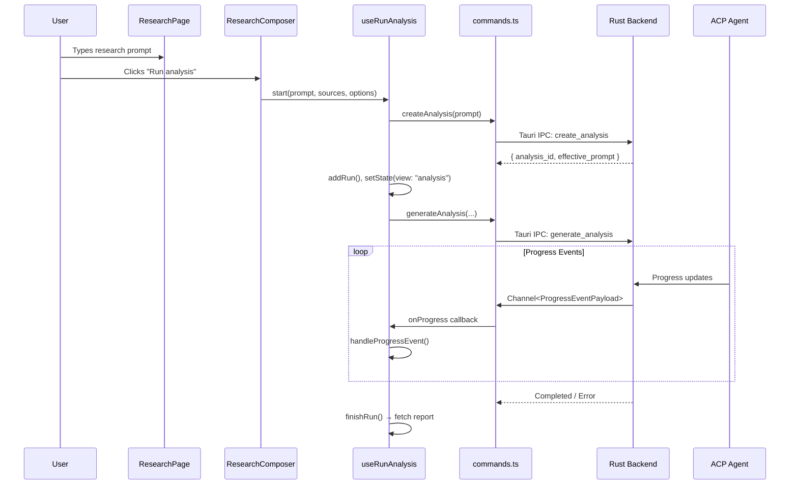
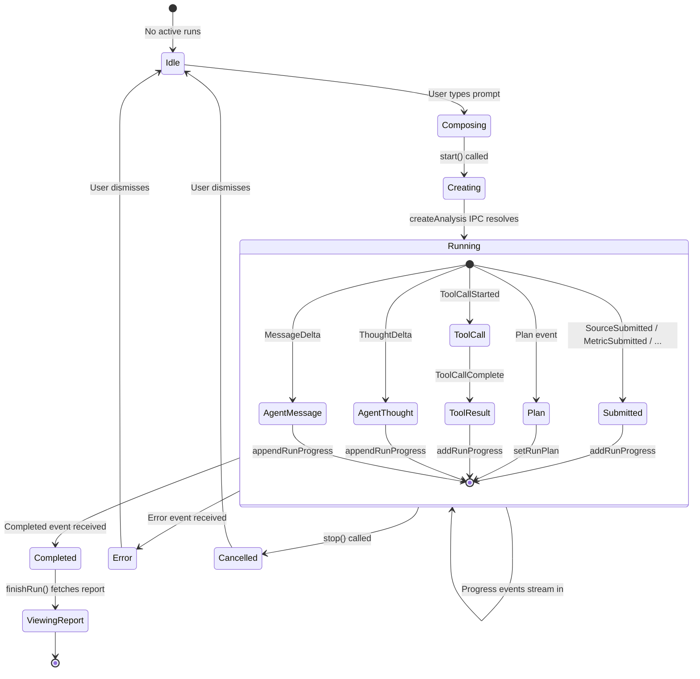

# Run Analysis

The run-analysis feature handles composing research queries, launching ACP agent runs, and displaying live agent progress. It lives in `frontend/src/features/run-analysis/` (12 files).

## Flow Overview

### useRunAnalysis state machine

The hook manages the lifecycle of analysis runs, tracking state transitions from composition through completion.

## ResearchPage

`frontend/src/features/run-analysis/ResearchPage.tsx` is the main research composition page. It renders:

1. **Hero section** — a marketing-style header with the title "Research your portfolio with clarity.", feature badges (Source-backed blocks, Filings & reports, Market data, Portfolio aware), and CTA buttons.
2. **StockTickerChips** — quick ticker buttons (AAPL, TSLA, NVDA, etc.) that append symbols to the prompt.
3. **ExamplePromptsGrid** — example research prompts that populate the input.
4. **Composer bar** — a fixed-bottom input area with:
   - A textarea for the research prompt
   - A `ResearchComposer` toolbar (agent selector, sources popover, explainable toggle, run button)
   - Keyboard shortcut: `Cmd+Enter` to run

The page manages local state for the prompt text and explainable mode (persisted to `localStorage`).

## ResearchComposer

`frontend/src/features/run-analysis/ResearchComposer.tsx` renders the toolbar below the prompt textarea. It provides:

- **AgentSelector** — dropdown to pick an ACP agent and optionally override its model.
- **SourcesPopover** — per-run data source selection (see below).
- **Explainable toggle** — enables metric explanation generation after the main analysis. When enabled, an `ExplainModelSelector` dropdown appears to pick the explanation model (defaults to `gpt-5.4-mini` if available).
- **Run button** — triggers `onRun()` with the selected sources and explainable options.
- **Error display** — shows a warning if no agent is available or if there's a local error.

Agent and model selections are persisted to the global store and backend via `persistModelByAgent`.

## useRunAnalysis Hook

`frontend/src/features/run-analysis/useRunAnalysis.ts` is the core hook for running analyses. It exposes:

| Function | Purpose |
|----------|---------|
| `start(prompt, enabledSources?, options?)` | Create a new analysis and start the agent run |
| `startWithAnalysisId(analysisId, prompt, overrides?)` | Start a run for an existing analysis |
| `stop(runId?)` | Stop one or all running analyses |

### `start()` Flow

1. Calls `createAnalysis(prompt)` via Tauri IPC to persist the analysis and get an `analysis_id`.
2. Calls `startWithAnalysisId()` with the new analysis ID.

### `startWithAnalysisId()` Flow

1. Resolves the effective agent and model (from overrides or store).
2. Generates a `runId` via `crypto.randomUUID()`.
3. Registers the run in the global store via `addRun()`.
4. Sets the view to `"analysis"` with `analysisSubTab: "agent"` to show the progress timeline.
5. Creates a Tauri `Channel<ProgressEventPayload>` for streaming progress events.
6. Calls `generateAnalysis()` via Tauri IPC.
7. On each progress event, calls `handleProgressEvent()` to update the store.
8. On `Completed` or `Error`, calls `finishRun()` to fetch the final report and switch to the report tab.

### `finishRun()` Flow

1. Switches `analysisSubTab` to `"report"`.
2. Fetches the full report via `getAnalysisReport()`.
3. Sets `selectedReport` in the store.
4. Invalidates TanStack Query caches for analyses.

## Progress Event Handling

`frontend/src/features/run-analysis/progress.ts` handles the mapping from backend progress events to store updates.

### Event Types

| Event | Store Action | Progress Type |
|-------|-------------|---------------|
| `MessageDelta` | `appendRunProgress` | `agent_message` |
| `ThoughtDelta` | `appendRunProgress` | `agent_thought` |
| `ToolCallStarted` | `addRunProgress` | `tool_call` |
| `ToolCallComplete` | `addRunProgress` | `tool_result` |
| `Plan` | `setRunPlan` + `addRunProgress` | `plan` |
| `PlanSubmitted` | `addRunProgress` | `submitted` |
| `SourceSubmitted` | `addRunProgress` | `submitted` |
| `MetricSubmitted` | `addRunProgress` | `submitted` |
| `ArtifactSubmitted` | `addRunProgress` | `submitted` |
| `BlockSubmitted` | `addRunProgress` | `submitted` |
| `StanceSubmitted` | `addRunProgress` | `submitted` |
| `ProjectionSubmitted` | `addRunProgress` | `submitted` |
| `Completed` | `addRunProgress` | `completed` |
| `Error` | `addRunProgress` | `error` |
| `Log` | `addRunProgress` | `log` |

Streaming deltas (`MessageDelta`, `ThoughtDelta`) use `appendRunProgress` which appends to the last progress item of the same type, enabling efficient streaming text accumulation.

### Timeline Block Assembly

`getTimelineBlocks(progress)` transforms the flat progress items array into a structured timeline:

- **Message blocks**: consecutive `agent_message`/`agent_thought` items are merged into a single block.
- **Tool blocks**: `tool_call` and `tool_result` items are paired by `tool_call_id`. The block tracks title, tool name, kind, arguments, result, and status (`running`/`completed`/`failed`).
- **Error blocks**: standalone error items.
- **System blocks**: everything else (plan updates, submissions, logs).

### Event Replay

`replayEvent(payload, items)` replays a single persisted event into a progress items array. This is used for hydrating the timeline from the database when switching tabs or loading a previous run.

## ProgressTimeline

`frontend/src/features/run-analysis/ProgressTimeline.tsx` renders the live agent progress display. It shows:

- **Run tabs** — when multiple runs are active, a tab bar to switch between them. Each tab shows a status icon (spinning circle for running, check for completed, X for error/cancelled).
- **Timeline blocks** — rendered as:
  - `MarkdownMessage` for message/thought blocks
  - `ToolCallCard` for tool call blocks (shows title, arguments, result, status)
  - `TimelineErrorBlock` for error blocks
- **Empty state** — when no runs exist, shows example prompts.
- **Hydration** — on tab switch, fetches persisted progress events via `getRunProgress()` and replays them.
- **Auto-scroll** — scrolls to bottom on mount.

## ExamplePromptsGrid

`frontend/src/features/run-analysis/ExamplePromptsGrid.tsx` provides four example research prompts:

1. "Compare NVDA to AMD across AI compute margins and supply constraints."
2. "Is the energy sector's dividend growth sustainable through 2027?"
3. "Stress-test US regional banks under a 300bps rate-hike shock."
4. "Build the bull and bear case for TSM, focusing on geopolitical risk."

Each prompt is a clickable card that populates the composer textarea. The grid shows 2 prompts by default with a "View all examples" toggle.

## SourcesPopover

`frontend/src/features/run-analysis/SourcesPopover.tsx` allows per-run data source selection. It renders as a portal-anchored popover above the trigger button, showing:

- A list of available sources sorted by active state.
- Each source shows display name, category, and a checkbox indicator.
- Sources requiring a key that isn't stored are disabled with a "no key" label.
- A "Manage sources" link at the bottom navigates to Settings.
- The trigger shows the active/available count (e.g., "08 / 12").

## StockTickerChips

`frontend/src/features/run-analysis/StockTickerChips.tsx` renders quick-access ticker buttons for 8 popular symbols (AAPL, TSLA, NVDA, AMD, MSFT, GOOGL, META, AMZN). Clicking a chip appends the symbol to the current prompt text. An "Add" button focuses the composer input.

## RecentAnalyses

`frontend/src/features/run-analysis/RecentAnalyses.tsx` shows the 3 most recent analyses as cards. Each card displays the title, intent, date, and a status badge (color-coded: running = blue, completed = green, failed = red, queued/cancelled = gray). Clicking a card navigates to the analysis view. The component uses `useAnalyses()` from TanStack Query and shows a loading skeleton while fetching.

## Key Source Files

| File | Lines | Purpose |
|------|-------|---------|
| `frontend/src/features/run-analysis/ResearchPage.tsx` | 243 | Main research composition page |
| `frontend/src/features/run-analysis/ResearchComposer.tsx` | 235 | Agent, sources, and run controls |
| `frontend/src/features/run-analysis/useRunAnalysis.ts` | 148 | Hook for creating and managing analysis runs |
| `frontend/src/features/run-analysis/progress.ts` | 260 | Progress event handling and timeline assembly |
| `frontend/src/features/run-analysis/ProgressTimeline.tsx` | 155 | Live agent progress display |
| `frontend/src/features/run-analysis/ExamplePromptsGrid.tsx` | 82 | Example research prompts |
| `frontend/src/features/run-analysis/SourcesPopover.tsx` | 158 | Per-run data source selection |
| `frontend/src/features/run-analysis/StockTickerChips.tsx` | 55 | Quick ticker input chips |
| `frontend/src/features/run-analysis/RecentAnalyses.tsx` | 118 | Recent analysis list |
| `frontend/src/features/run-analysis/errors.ts` | 42 | Error normalization utilities |
| `frontend/src/features/run-analysis/TimelineErrorBlock.tsx` | 42 | Error block rendering |

## Related Pages

- [Frontend Architecture](frontend-architecture.md) — state management and navigation
- [Report Viewer](report-viewer.md) — how completed reports are rendered
- [Settings](settings.md) — agent and data source configuration
