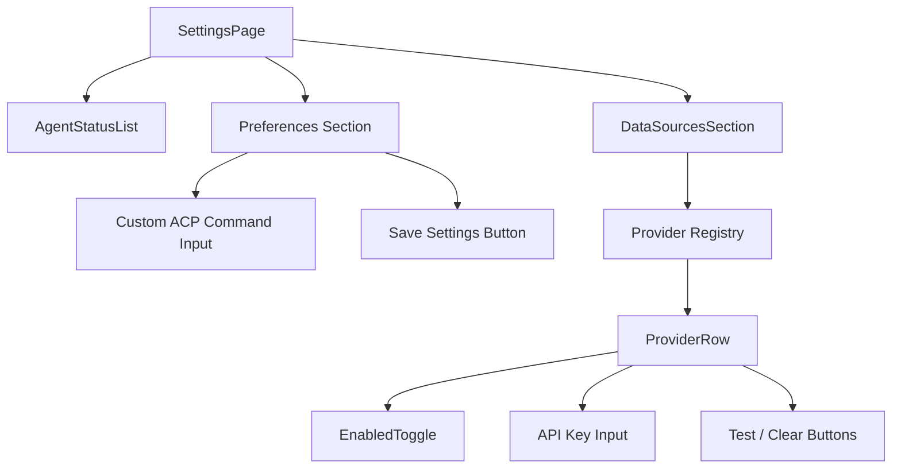
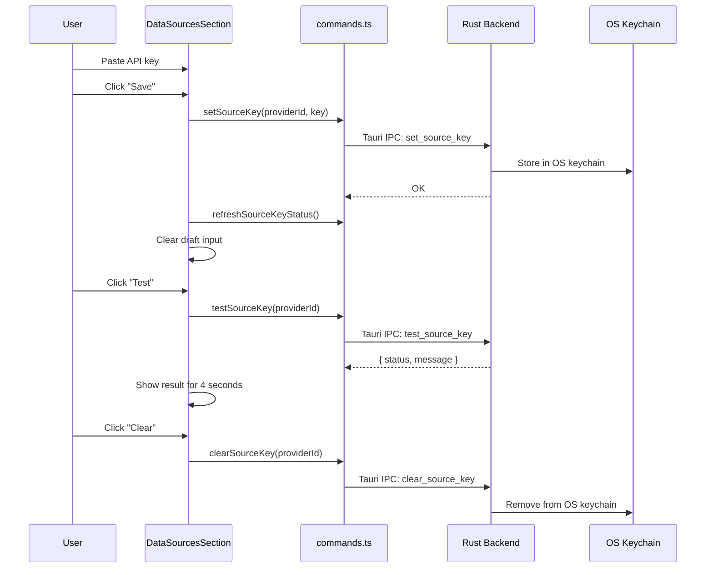

# Settings

The settings feature manages ACP agent configuration, data source providers, and application preferences. It lives in `frontend/src/features/settings/` (3 files).

## Architecture Overview

## SettingsPage

`frontend/src/features/settings/SettingsPage.tsx` renders the settings page with three numbered sections:

### Hero Section

A marketing-style header with "Settings & configuration." title and feature badges (ACP-compatible agents, Local execution, Source-backed research).

### Section 01: Agents

Displays detected ACP agents via `AgentStatusList`. Includes a description explaining that unavailable agents should be checked against `PATH` or environment overrides (`CODEX_ACP_BIN`, `INFI_CUSTOM_AGENT`).

### Section 02: Preferences

Renders the overrides form:

- **Custom ACP command** — a text input for an absolute path to a custom ACP agent binary. Stored in `settings.custom_agent_command`.
- **Save button** — persists settings via `useUpdateSettings` mutation, which calls `update_settings` on the backend.

The component uses a local copy of settings (`localSettings`) to avoid optimistic update issues. Changes are only persisted when the user clicks Save.

### Section 03: Data Sources

Rendered by `DataSourcesSection` (see below).

## AgentStatusList

`frontend/src/features/settings/AgentStatusList.tsx` displays a list of detected ACP agents in a card. Each row shows:

- Zero-padded index
- Agent logo (loaded via `getLogoPath(agent.label)`)
- Agent label and command path (or "Not found on PATH")
- Status tag: green "Available" or gray "Missing"

If no agents are detected, shows a message: "No ACP agents detected on this machine."

## DataSourcesSection

`frontend/src/features/settings/DataSourcesSection.tsx` (385 lines) manages the data source provider registry. It's the most complex settings component.

### Provider Registry

Sources are grouped by category and displayed in a fixed order:

| Category | Label |
|----------|-------|
| `web_search` | Web Search |
| `filings` | Filings |
| `fundamentals` | Fundamentals |
| `market_data` | Market Data |
| `news` | News |
| `forums` | Forums |
| `screener` | Screener |

Each category shows a header with index, label, and enabled/total count (e.g., "03 / 05").

### ProviderRow

Each provider row displays:

- **Info column**:
  - Key status: "Key stored", "Key required", or "No key"
  - Rate limit hint (if any)
  - Provider display name (16px, semibold)
  - Description
  - Links: Docs, Get key (if applicable), provider ID
- **Toggle column**: an `EnabledToggle` button (blue when enabled, gray when disabled)
- **Key management** (for providers requiring keys):
  - Password input for API key
  - Save/Replace button
  - Test button (validates the key)
  - Clear button (removes stored key)
  - Test result indicator (green "OK" or red "FAIL · reason")
- **Reachability test** (for keyless providers):
  - "Test reachability" button with result indicator

### API Key Management Flow

API keys are stored in the OS keychain — Infi never writes them to disk. The `has_key` field on `SourceDescriptor` indicates whether a key is currently stored.

### Enable/Disable Toggle

Toggling a source calls `setEnabledSources` with the full list of enabled source IDs. This persists globally — the source will be available (or unavailable) for all future runs. Per-run overrides are handled by `SourcesPopover` in the research composer.

### Test Results

Test results are displayed inline for 4 seconds, then auto-cleared. The result shows either a green "OK" or a red "FAIL · {first 40 chars of error message}".

## Settings Model

The backend settings model is defined in `src/infra/app_config.rs`. The frontend `AppSettings` type includes:

| Field | Type | Purpose |
|-------|------|---------|
| `custom_agent_command` | `string \| null` | Absolute path to custom ACP agent binary |
| `custom_agent_args` | `string[]` | Arguments for the custom agent |
| `timeout_secs` | `number` | Agent run timeout |
| `source_freshness_days` | `number` | How old source data can be before flagged stale |
| `disclaimer` | `string` | Report disclaimer text |
| `model_by_agent` | `Record<string, string>` | Per-agent model override map |
| `enabled_sources` | `string[]` | List of enabled source provider IDs |
| `sources_with_keys` | `string[]` | List of source IDs that have stored keys |

Settings are fetched via `useSettings()` (TanStack Query) and updated via `useUpdateSettings()` mutation.

## Agent Selection and Model Override

Agent and model selection happens in two places:

1. **Settings page** — the `AgentStatusList` shows detected agents but doesn't allow selection.
2. **Research composer** — the `AgentSelector` dropdown lets users pick an agent and optionally override its model. The selection is persisted to the global store (`agentId`, `modelByAgent`) and to the backend via `persistModelByAgent()`.

The `modelByAgent` map is loaded from settings on app start and updated whenever the user changes a model selection.

## Key Source Files

| File | Lines | Purpose |
|------|-------|---------|
| `frontend/src/features/settings/SettingsPage.tsx` | 185 | Main settings page with 3 sections |
| `frontend/src/features/settings/DataSourcesSection.tsx` | 385 | Data source provider registry with key management |
| `frontend/src/features/settings/AgentStatusList.tsx` | 62 | ACP agent status display |

## Related Pages

- [Frontend Architecture](frontend-architecture.md) — state management and TanStack Query patterns
- [Run Analysis](run-analysis.md) — where agent selection and source configuration are used
- [Portfolio](portfolio.md) — portfolio analysis uses the same agent and source configuration
