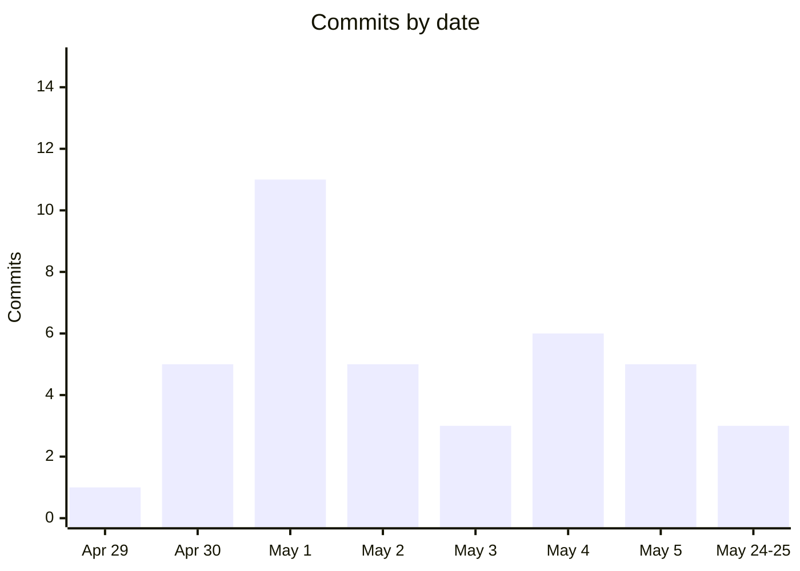

# Lore

A narrative history of the Infi codebase — from first commit to v0.1.6 in under a month.

## Timeline



## Eras

### Genesis — Apr 29, 2026

The project began with a single commit: `init Infi`. This initial commit established the full Tauri 2 application scaffold with a Rust backend and Vite React frontend, including the core domain types, SQLite persistence layer, ACP agent integration, and a working desktop shell. The foundation was ambitious — a local-first AI-powered stock market analysis workbench using the Agent Client Protocol to orchestrate research agents.

### UI Polish — Apr 30 – May 1

Within 24 hours of the initial commit, the focus shifted to making the app presentable. A comprehensive design system and component library landed (`feat(ui): add comprehensive design system and component library`), along with favicon assets, metadata links, and an editorial visual language with hairline borders, numbered sections, and restrained typography. The CI/CD pipeline was built out in parallel — switching from pnpm to Bun, adding Windows release targets, and configuring macOS signing gates. By the end of this era, Infi had cross-platform install scripts (NSIS for Windows, AppImage for Linux) and a multi-platform release workflow.

### Feature Expansion — May 1–4

The core product features arrived in a concentrated burst. Metric explanation tooltips let users understand the numbers in their reports. A markdown number-highlighting system made financial data visually scannable. The report viewer grew structured artifact views and projection displays. Portfolio analysis with VND currency support and a dedicated insights component gave the tool real analytical depth. Each feature was paired with the prompt engineering needed to drive it — Handlebars templates that instruct the ACP agent to submit structured data via MCP tools.

### Refinement — May 4–5

A cleanup pass followed the feature rush. Batch file detection was fixed to work case-insensitively on Windows. UI components were simplified and dependencies updated. Format and portfolio helpers were centralized to reduce duplication. Version bumps from v0.1.3 through v0.1.6 were cut in rapid succession, each reflecting a stable increment of the product.

### Documentation & Packaging — May 5–25

The final era shifted outward — away from the codebase and toward the people who might use or contribute to it. Architecture documentation was written. A conference poster was created (`infi-poster-standalone.html`). A landing page was built. Agent icon assets were added. The project went from a working prototype to a presentable open-source effort.

## Version History

| Tag | Date | Highlights |
|---|---|---|
| `v0.1.0` | 2026-05-01 | Initial release — full Tauri app, design system, CI/CD |
| `v0.1.1` | 2026-05-02 | Markdown number highlighting, copyright fixes |
| `v0.1.2` | 2026-05-03 | Testing stack (Vitest), Vite WebView targeting |
| `v0.1.3` | 2026-05-04 | Multi-platform release matrix, GitHub Pages |
| `v0.1.4` | 2026-05-04 | Windows batch file fix, UI token updates |
| `v0.1.5` | 2026-05-05 | Portfolio insights, VND currency, metric tooltips |
| `v0.1.6` | 2026-05-05 | Dependency cleanup, UI simplification, centralized helpers |

## Growth Trajectory

Infi went from zero to a shippable desktop app with 7 tagged releases in 27 days. The commit cadence tells the story: an intense first week (37 commits in May) followed by a three-week documentation and packaging phase (3 commits in late May). The codebase grew to ~35K lines across Rust and TypeScript, with 147 Rust test functions and a CI pipeline that validates across Linux, macOS, and Windows.

Three commits carry Claude Opus co-authorship trailers, indicating AI-assisted development during the refinement era.

## Commit Log (Chronological)

```
35f3585 init Infi
97a4c23 Update UI theme, viewer build, and artifact kinds
f6fde8f feat(ui): add comprehensive design system and component library
ee9e1d2 Add favicon and metadata links to index.html
07b1712 Add favicon and app icon assets
e764de9 Add artifact
f3f0f48 change to bun
d0d8b2d ci(landing): switch from pnpm to Bun; add Windows release target
8dc98b1 ci(release): upgrade Ubuntu to 24.04 and switch frontend to Bun
8ab1bf8 ci(release): gate macOS signing behind MACOS_SIGNING_ENABLED variable
0be32c9 ci(landing): add Windows support and winget publishing workflow
33006e2 Add install scripts for Windows (NSIS) and Linux (AppImage)
512d914 ci(release): disable macOS code signing for unsigned builds
6ee4888 Update UI theme with editorial styling and accent colors
6de11ae Add report-shell-scroll class for text selection in report shell
5c50a75 feat(report-viewer): add metric explanations with tooltips and explainable runs
c513f46 feat(ui): add MetricExplanationTooltip component and explanation prompt template
29f3a56 ci(release): disable macOS builds and Linux tarball
594f206 ci(release): update repo references to khanhthanhdev and disable homebrew bump
935d16d Update copyrights and fix Windows batch file execution
c716180 feat(frontend): add number highlighting in markdown
c982dc9 chore: bump version to 0.1.1
1fa0ff3 style: fix cargo fmt in agent_discovery tests
a68e65f feat(frontend): add testing stack and markdown highlight utilities
6369366 feat(report-viewer): add markdown number highlight utilities and tests
6ce3bef build(vite): target WebView engine and conditionally minify
f39fd3d chore: bump version to 0.1.2
1eca066 update landing page and shell path for Windows Scoop
603b36a add image
75ca2ec ci(release): add macOS unsigned notes and multi-platform release matrix
7d01a24 chore: bump version to 0.1.3
9f0e9f6 ci(workflows): enable GitHub Pages and update UI tokens
6ac37fd Update image
0914282 chore: bump version to 0.1.4
44b700c fix(infra): detect batch files case-insensitively and clean up shell logic
3562b94 feat(portfolio): add VND currency, metric tooltips, and insights section
f45de7c feat(portfolio): add portfolio insights component and static explanations
0002b5b Update to v 0.1.5
4748253 refactor(frontend): centralize format/portfolio helpers and export replayEvent
820e684 Update dependencies and simplify UI components
b955341 Bump version to 0.1.6
84afc12 add poster
d440ea4 feat(poster): Add poster page and link from landing
d8ff49c Add agent icon assets
```
