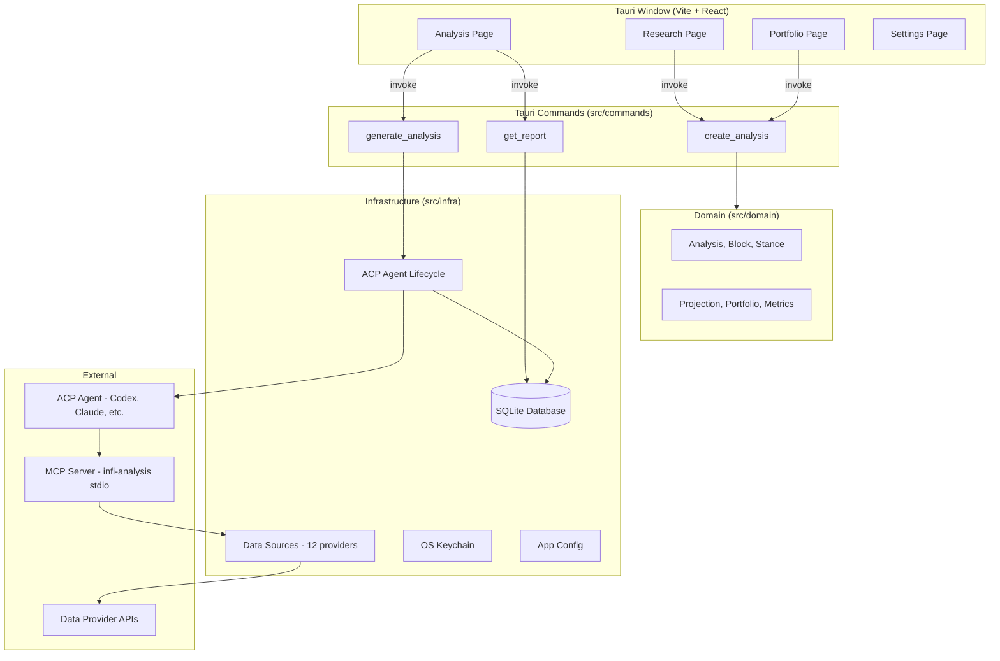
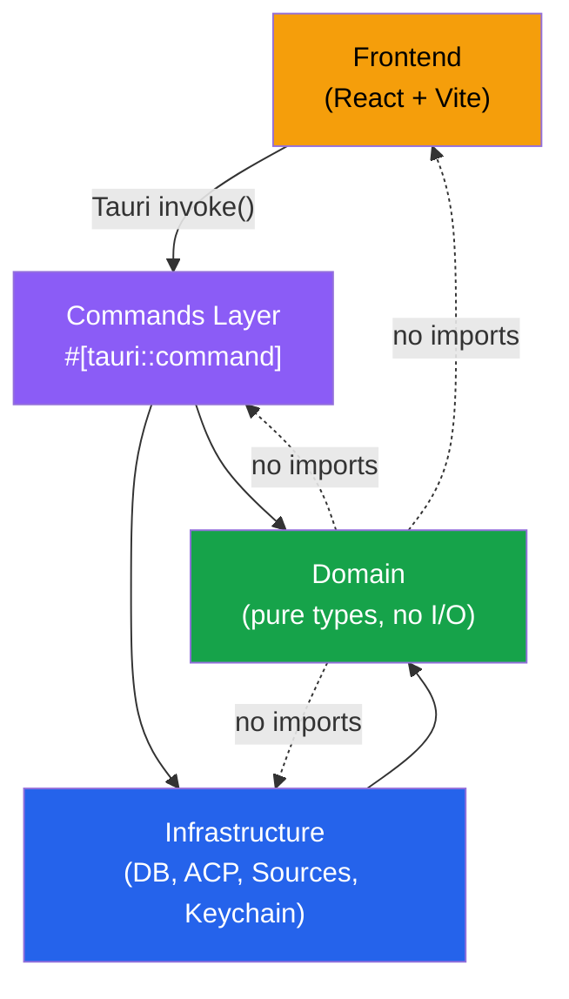
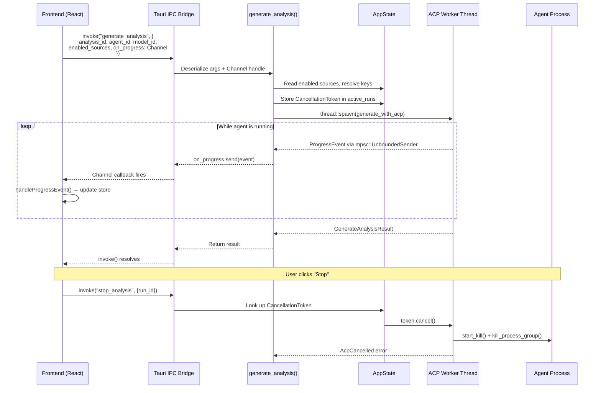
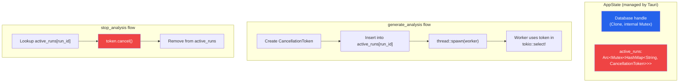
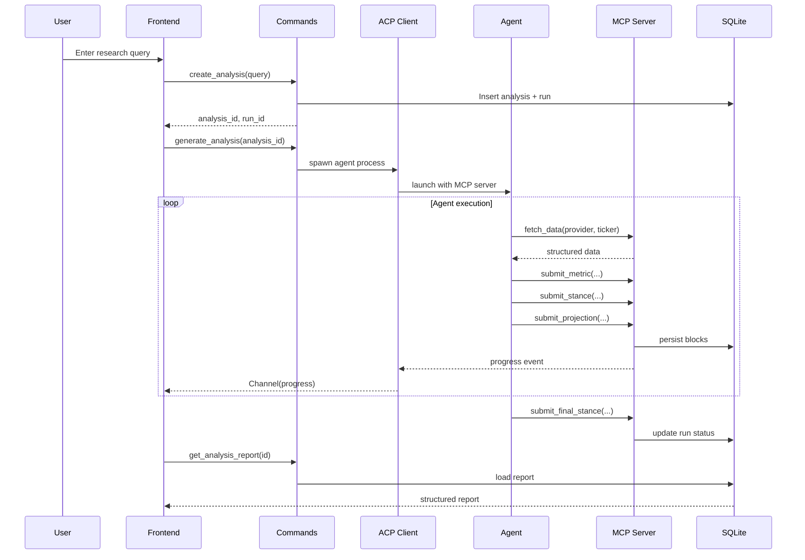

# Architecture

Infi follows a strict layered architecture. Domain types are leaf nodes with no I/O dependencies. Infrastructure handles persistence, agent orchestration, and external APIs. Commands bridge the frontend to backend via Tauri IPC. The frontend communicates exclusively through `invoke` calls and never imports Rust code directly.

## Layer map

| Layer | Path | Responsibility | Dependencies |
|---|---|---|---|
| **Domain** | `src/domain/` | Pure types: analyses, runs, entities, sources, metrics, blocks, stances, projections, portfolios. No I/O. | `serde`, `chrono` |
| **Infrastructure** | `src/infra/` | SQLite persistence, ACP agent lifecycle, data-source providers, OS keychain, app configuration, price history, CSV parsing, shell utilities. | `rusqlite`, `pmcp`, `agent-client-protocol`, `reqwest`, `keyring`, `tokio` |
| **Commands** | `src/commands/` | Tauri `#[tauri::command]` handlers bridging frontend IPC to domain + infra. Contains the `generate_analysis` orchestration, export/publish, and source management. | `domain`, `infra`, `tauri` |
| **Prompts** | `src/prompts.rs` | Handlebars templates and prompt-building logic for the main analysis pass and explanation pass. | `domain`, `infra/db`, `handlebars` |
| **State** | `src/state.rs` | `AppState` holding the `Database` handle and a map of `CancellationToken`s for active runs. Managed by Tauri as shared state. | `infra/db`, `tokio-util` |
| **Frontend** | `frontend/src/` | React SPA: research composer, live agent progress, report viewer, portfolio management, settings. | `@tauri-apps/api`, `@tanstack/react-query`, custom store, `react`, Tailwind |

## High-level architecture

## Dependency rule

Domain types are leaf nodes — nothing in `domain` imports from `infra`, `commands`, or the frontend. Infrastructure depends on domain. Commands depend on both. This constraint keeps the domain model testable and framework-agnostic.

## Tauri IPC and Channel streaming

The frontend communicates with the Rust backend exclusively through Tauri's `invoke()` mechanism. For long-running operations like `generate_analysis`, a `Channel<ProgressEventPayload>` is used to stream real-time events from the Rust backend to the frontend.

### AppState and run cancellation

## Run lifecycle

1. The user composes a research query on the **Research Page** and picks an ACP agent.
2. `create_analysis` writes an `Analysis` row (status: `queued`) and a `Run` row to SQLite.
3. `generate_analysis` resolves the agent binary via `agent_discovery`, spawns it as a child process, and connects over ACP stdio.
4. The agent calls MCP tools exposed by `analysis_mcp_server` to submit plan entries, fetch data from providers, write structured blocks (metrics, stances, projections), and finally submit a `FinalStance`.
5. Progress events stream to the frontend via a Tauri `Channel`.
6. When the agent finishes, the run status updates to `completed` or `failed`, and the report becomes available in the report viewer.

## Data flow

## Entry point

The application starts in `src/main.rs`. It initializes the logger, fixes PATH on Unix, captures the shell PATH, then either runs as an MCP server (if `--analysis-mcp-server` is passed), prints environment info (if `--printenv` is passed), or launches the Tauri window with all commands registered.

## Key source files

| File | Purpose |
|---|---|
| `src/main.rs` | Application entry point, Tauri builder, command registration |
| `src/lib.rs` | Module re-exports |
| `src/state.rs` | `AppState` with database handle and active run cancellations |
| `src/commands/mod.rs` | All Tauri IPC command handlers (1942 lines) |
| `src/domain/analysis.rs` | Core analysis types: `Analysis`, `AnalysisReport`, `AnalysisBlock`, `FinalStance` |
| `src/domain/portfolio.rs` | Portfolio types: `Portfolio`, `PortfolioHolding`, `PortfolioTransaction` |
| `src/infra/db/mod.rs` | SQLite schema, migrations, and all persistence operations (5268 lines) |
| `src/infra/acp/analysis_generator/client.rs` | ACP client that spawns and communicates with agents |
| `src/infra/acp/analysis_mcp_server/tool.rs` | MCP tool definitions the agent calls to submit data |
| `src/prompts.rs` | Handlebars prompt templates for analysis and explanation passes |
