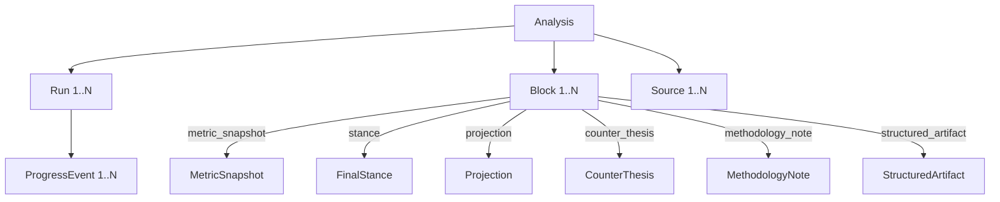

# Data models

Core domain types defined in `src/domain/`. These are pure data structures with no I/O dependencies.

## Analysis

The central entity. An analysis represents a single research session.

### Key types in `src/domain/analysis.rs`

| Type | Description |
|---|---|
| `Analysis` | Top-level entity with ID, title, user prompt, intent, status, timestamps |
| `AnalysisRun` | A single execution attempt with status, agent ID, start/end times |
| `AnalysisBlock` | A typed report block: metric, stance, projection, methodology, etc. |
| `AnalysisReport` | Full report assembly: analysis + blocks + sources + runs |
| `AnalysisSummary` | Lightweight summary for list views |
| `AnalysisStatus` | Enum: `queued`, `running`, `completed`, `failed`, `cancelled` |
| `AnalysisIntent` | Enum: `single_equity`, `compare_equities`, `sector_analysis`, `macro_theme`, `watchlist`, `portfolio`, `general_research` |
| `FinalStance` | The agent's concluding position with bull/bear/neutral classification |
| `Projection` | Forward-looking scenario analysis with bull/base/bear cases |
| `MetricSnapshot` | A point-in-time financial metric with value, unit, and timestamp |
| `StructuredArtifact` | Generic typed block with kind, title, content, and optional table data |

## Portfolio

Portfolio types in `src/domain/portfolio.rs`:

| Type | Description |
|---|---|
| `Portfolio` | A named collection of holdings with base currency |
| `PortfolioHolding` | A single position with ticker, shares, cost basis |
| `PortfolioTransaction` | A buy/sell/dividend/other transaction with date and amount |
| `PortfolioImportBatch` | A batch of imported rows from CSV |
| `PortfolioImportKind` | Enum: `positions`, `transactions` |
| `PortfolioDetail` | Full portfolio with holdings, accounts, and risk metrics |

## Freshness

Types in `src/domain/freshness.rs` for tracking metric age:

| Type | Description |
|---|---|
| `FreshnessBucket` | Enum: `fresh`, `aging`, `stale`, `expired` |
| `VerificationStatus` | Enum: `verified`, `unverifiable`, `stale` |
| `StaleStanceMetric` | A metric that has exceeded the freshness window |

## Run context

`RunContext` in `src/domain/run.rs` carries runtime state for a single analysis run:

| Field | Type | Description |
|---|---|---|
| `analysis_id` | `String` | The analysis being executed |
| `run_id` | `String` | This specific run |
| `enabled_sources` | `HashSet<String>` | Data sources enabled for this run |
| `cancellation_token` | `CancellationToken` | Token to cancel the run |

## Frontend types

The frontend mirrors these types in `frontend/src/types/index.ts` (767 lines). Key additions:

| Type | Description |
|---|---|
| `RunState` | Tracks active run progress items and plan entries |
| `ProgressItem` | A single progress event for the timeline display |
| `PlanEntry` | A research plan step submitted by the agent |
| `SourceDescriptor` | Provider metadata with enable/key status |

## Key source files

| File | Purpose |
|---|---|
| `src/domain/analysis.rs` | Analysis, run, block, stance, projection types (1158 lines) |
| `src/domain/portfolio.rs` | Portfolio, holding, transaction types (343 lines) |
| `src/domain/freshness.rs` | Metric freshness and verification types |
| `src/domain/run.rs` | RunContext type |
| `frontend/src/types/index.ts` | Frontend TypeScript type definitions (767 lines) |
