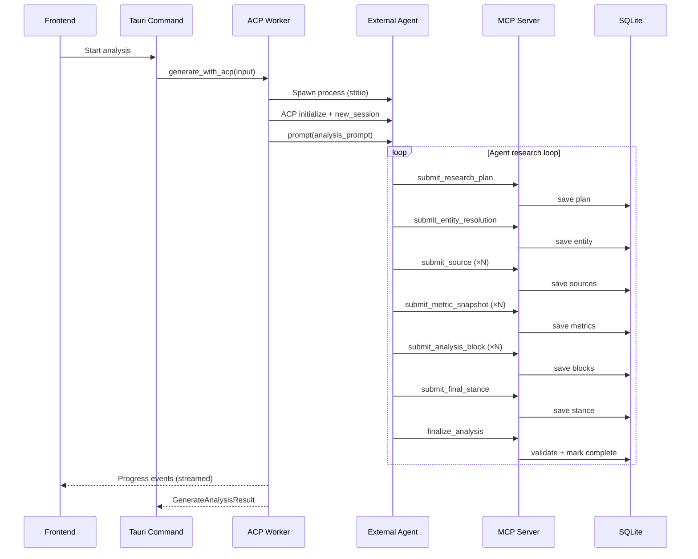
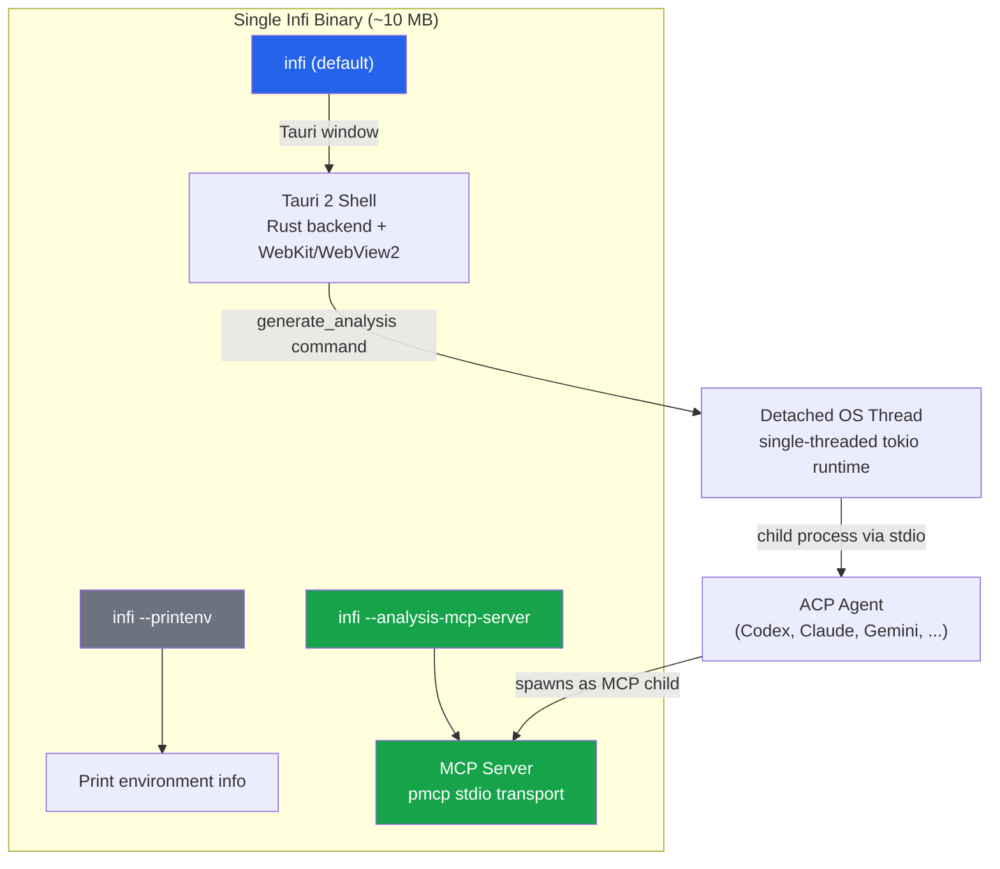
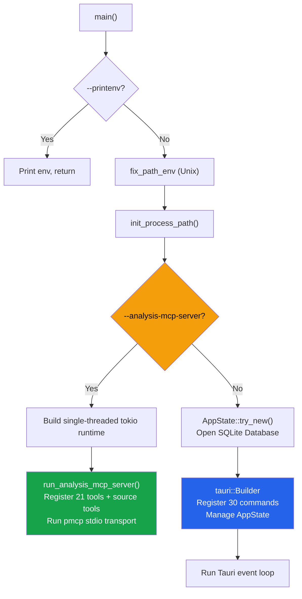
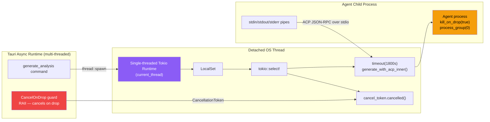
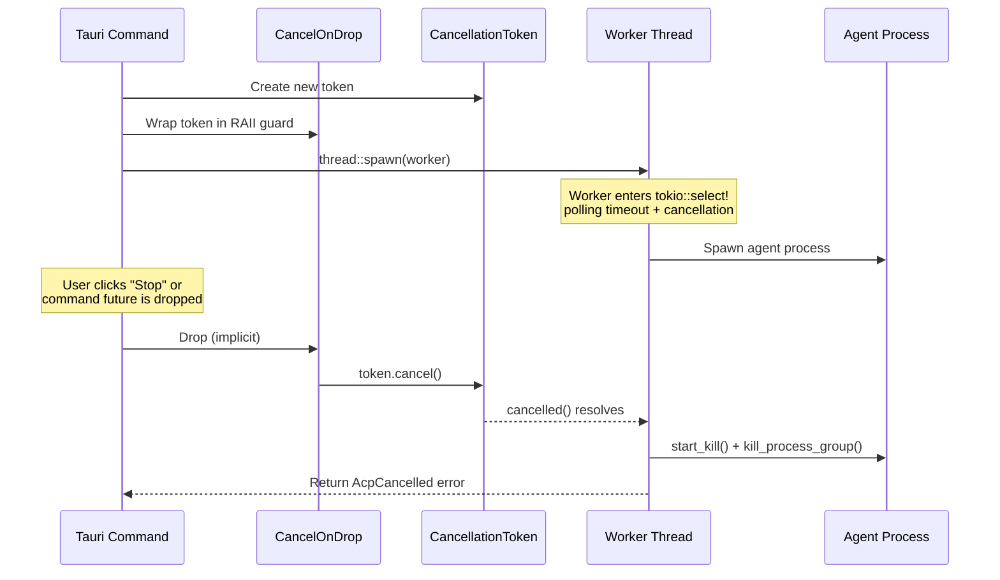
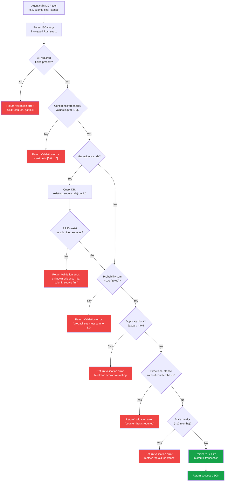
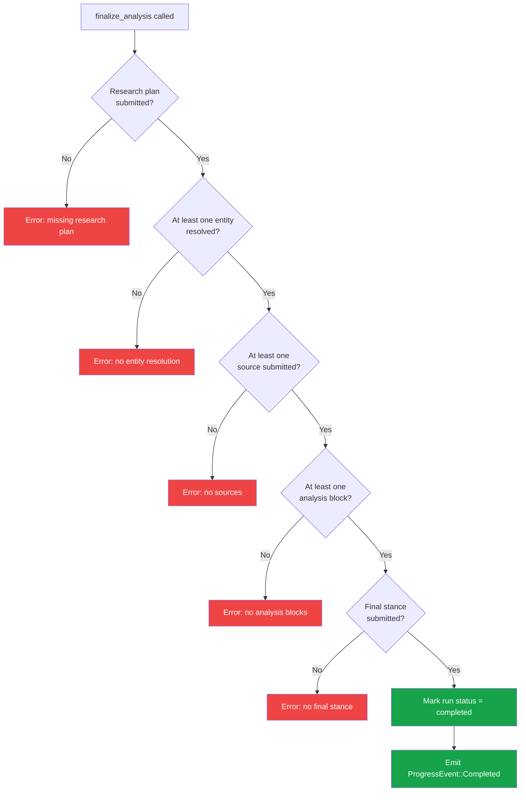

# ACP Integration

The ACP (Agent Client Protocol) integration is the subsystem that spawns external coding agents, communicates with them over stdio, and persists their structured analysis output to the database. It is the core engine that turns a user's research question into a complete analysis report.

## Key source files

| File | Purpose |
|---|---|
| `src/infra/acp/mod.rs` | Module root; re-exports `AgentCandidate`, `list_agent_candidates`, `resolve_agent_launch`. |
| `src/infra/acp/agent_discovery.rs` | Agent registry: discovers and configures all supported agents. |
| `src/infra/acp/analysis_generator/mod.rs` | Re-exports worker types. |
| `src/infra/acp/analysis_generator/worker.rs` | Spawns the agent process, manages ACP session lifecycle, handles cancellation and timeouts. |
| `src/infra/acp/analysis_generator/client.rs` | Implements the ACP `Client` trait; processes streamed messages, tool calls, and progress events. |
| `src/infra/acp/analysis_mcp_server/mod.rs` | MCP server entry point; registers all tools and data-source providers. |
| `src/infra/acp/analysis_mcp_server/tool.rs` | Tool implementations (~3100 lines): validation, DB persistence, and finalization logic for every MCP tool. |
| `src/infra/acp/analysis_mcp_server/config.rs` | Server configuration: CLI args, env vars, run context loading. |
| `src/infra/progress.rs` | Progress event types streamed from worker to frontend. |

## Overall flow



## Process tree

Infi is a single Rust binary that serves three roles depending on CLI flags. The same executable that renders the Tauri window is also re-invoked as the MCP server child process that the agent talks to.



The entry point in `src/main.rs` branches early:



## ACP worker thread isolation

The Agent Client Protocol connections are `!Send` — they cannot be moved across async tasks. But Tauri's async runtime expects commands to be `Send`. The solution: spawn a dedicated OS thread with its own single-threaded tokio runtime for each ACP session.



### CancelOnDrop RAII pattern

The worker thread's lifetime is not bound to the parent Tauri command. If the parent is dropped (command cancelled, panic, app shutdown), the detached thread would keep running and the agent child process would survive. The `CancelOnDrop` guard solves this:



## ACP session lifecycle

The ACP connection goes through a strict sequence of states. Each state transition is driven by a specific API call, and the worker polls for finalization every 200ms.

```mermaid
stateDiagram-v2
    [*] --> Spawning: thread::spawn
    Spawning --> Connecting: cmd.spawn()
    Connecting --> Initializing: ClientSideConnection::new()
    Initializing --> SessionCreated: connection.initialize()
    SessionCreated --> Prompting: connection.new_session()<br/>with MCP server config
    Prompting --> ResearchLoop: connection.prompt()
    ResearchLoop --> ResearchLoop: Agent calls MCP tools
    ResearchLoop --> Finalized: finalize_analysis received
    ResearchLoop --> Exited: Agent process exits
    ResearchLoop --> TimedOut: 1800s timeout
    ResearchLoop --> Cancelled: CancellationToken fired
    Finalized --> [*]: kill process group
    Exited --> [*]: Check finalization flag
    TimedOut --> [*]: kill process group
    Cancelled --> [*]: kill process group
```

### MCP server injection

When the worker calls `new_session()`, it configures the agent to spawn Infi's own MCP server as a child process. The same binary is re-invoked with `--analysis-mcp-server`:

```mermaid
sequenceDiagram
    participant WK as ACP Worker
    participant AG as Agent Process
    participant MCP as Infi MCP Server

    WK->>AG: new_session(McpServerStdio)
    Note over WK: Config: binary = current_exe()<br/>args = ["--analysis-mcp-server",<br/>  "--analysis-context", context_file,<br/>  "--db-path", db_path]<br/>env = INFI_SRC_KEY_* per provider
    AG->>MCP: Spawn as child process
    AG->>MCP: MCP initialize (stdio)
    MCP-->>AG: Server capabilities (tools_only)
    Note over MCP: Registers 21 built-in tools<br/>+ source provider tools<br/>for enabled sources with keys

## Agent discovery (`agent_discovery.rs`)

### Types

```rust
pub struct AgentCandidate {
    pub id: String,           // e.g. "codex", "claude"
    pub label: String,        // Display name
    pub command: Option<String>, // Resolved binary path
    pub args: Vec<String>,    // Default launch arguments
    pub available: bool,      // Whether the binary was found
    pub models: Vec<AgentModel>,
    pub supports_model_override: bool,
}

pub struct AgentLaunch {
    pub command: String,
    pub args: Vec<String>,
    pub env: Vec<(String, String)>,
}
```

### Supported agents

| Agent ID | Label | Discovery | Binary source |
|---|---|---|---|
| `codex` | Codex | `CODEX_ACP_BIN` env or `npx -y @zed-industries/codex-acp@latest` | npx |
| `claude` | Claude | `CLAUDE_ACP_BIN` env or `npx -y @zed-industries/claude-code-acp` | npx |
| `gemini` | Gemini | `GEMINI_ACP_BIN` env or `gemini --acp` on PATH | direct |
| `qwen` | Qwen Code | `QWEN_ACP_BIN` env or `qwen --acp` on PATH | direct |
| `mistral` | Mistral Vibe | `MISTRAL_ACP_BIN` env or `vibe-acp` on PATH | direct |
| `kimi` | Kimi | `KIMI_ACP_BIN` env or `kimi --acp` on PATH | direct |
| `opencode` | OpenCode | `OPENCODE_ACP_BIN` env or `opencode acp` on PATH | direct |
| `pi` | Pi | `PI_ACP_BIN` env or `npx -y pi-acp` | npx |
| `custom` | Custom | `INFI_CUSTOM_AGENT` env or settings | user-defined |

### Resolution logic

`resolve_agent_launch(agent_id, model_id)`:

1. Looks up the agent by ID in the registry.
2. Falls back to the first available agent if the requested one is not found.
3. Validates model selection (rejects model override for agents that don't support it).
4. Builds the `AgentLaunch` with model-specific args (e.g., `--model sonnet` for Claude, `-c model=gpt-5.4` for Codex).

Each agent struct implements the `AgentDefinition` trait, which provides `candidate()` and `build_launch_for_model()`. Model args are appended differently per agent — Codex uses `-c model=X`, Claude uses `--model X`, OpenCode prepends `--model X` before the subcommand.

### Binary discovery

- `find_bin(name)` — Searches the system PATH via `which`.
- `resolve_env_bin(path)` — Resolves an env-var-provided path, checking if the file exists.
- On Windows, `.cmd`/`.bat` files are wrapped with `cmd /C` for proper execution.

## Analysis generator

### Worker (`worker.rs`)

The worker runs on a **detached OS thread** with its own single-threaded Tokio runtime. This isolation prevents Tauri's async runtime from blocking on agent I/O.

```rust
pub async fn generate_with_acp(mut input: GenerateAnalysisInput) -> Result<GenerateAnalysisResult>
```

Key behaviors:

- **Timeout**: Default 1800 seconds (30 minutes). Wraps the inner work in `tokio::time::timeout`.
- **Cancellation**: Uses a `CancellationToken` + RAII `CancelOnDrop` guard. If the parent future is dropped, the token cancels and the child process is killed.
- **Process management**: Spawns the agent with `kill_on_drop(true)`, `process_group(0)` on Unix for clean group kills, and `suppress_windows_console_tokio` on Windows.
- **Secret redaction**: All source API keys are redacted from logs before they reach the frontend.
- **MCP server injection**: The same Infi binary is re-invoked with `--analysis-mcp-server` as the MCP child process. Source keys are injected as `INFI_SRC_KEY_<ID>` environment variables.
- **Context file**: A temporary file containing the serialized `RunContext` is passed to the MCP server via `--analysis-context`.

The worker loop:
1. Spawns the agent process.
2. Pipes stderr to a logging task (with secret redaction).
3. Creates an `InfiClient` and establishes the ACP connection.
4. Calls `initialize()` → `new_session()` (with MCP server config) → `prompt()`.
5. Polls for finalization or agent exit every 200ms.
6. Kills the process group on completion/cancellation/timeout.

### Client (`client.rs`)

`InfiClient` implements `agent_client_protocol::Client`. It processes four types of ACP events:

| ACP Event | Handler |
|---|---|
| `SessionUpdate::AgentMessageChunk` | Appends to message buffer, emits `MessageDelta` progress. |
| `SessionUpdate::AgentThoughtChunk` | Appends to thought buffer, emits `ThoughtDelta` progress. |
| `SessionUpdate::ToolCall` | Tracks pending tool calls, emits `ToolCallStarted` / `ToolCallComplete`. |
| `SessionUpdate::ToolCallUpdate` | Merges updates into pending calls, emits completion on terminal status. |
| `SessionUpdate::Plan` | Emits `Plan` progress with frontend-formatted entries. |
| `ext_method` / `ext_notification` | Handles extension payloads for `finalize_analysis` and other Infi tools. |

The client tracks tool call names in a `HashMap<tool_call_id, tool_name>` to correlate started/completed events. It also maintains per-message-ID streaming lengths to compute deltas efficiently.

Permission requests from the agent are auto-approved (allow-once).

## MCP Server (`analysis_mcp_server/`)

### Server setup (`mod.rs`)

The MCP server runs as a **child process** of the agent. It uses the `pmcp` crate to expose tools over stdio:

```rust
pub async fn run_analysis_mcp_server() -> pmcp::Result<()>
```

The server registers:
- **21 built-in tools** for submitting analysis artifacts.
- **Data-source tools** for each enabled provider (e.g., `tavily_search`, `sec_edgar_lookup`). Providers requiring API keys are skipped if no key is available.

### Configuration (`config.rs`)

```rust
pub struct ServerConfig {
    pub run_context: Option<PathBuf>,
    pub db_path: Option<PathBuf>,
    pub source_keys: HashMap<String, String>,
}
```

Loaded from CLI args (`--analysis-context`, `--db-path`) and environment variables (`INFI_ANALYSIS_CONTEXT`, `INFI_DB_PATH`, `INFI_SRC_KEY_*`). The `load_context()` method reads and deserializes the `RunContext` JSON file.

### Tool definitions (`tool.rs`)

Each tool is a `SimpleTool` with a JSON schema, validation, and DB persistence. The full tool set:

| Tool | Purpose |
|---|---|
| `submit_research_plan` | Persists the agent's interpreted intent, decision criteria, and planned checks. |
| `submit_entity_resolution` | Resolves a ticker/company/ETF/sector entity with confidence score. |
| `submit_source` | Registers a source before citing it. Required for evidence ID validation. |
| `verify_source_accessibility` | HEAD/GET probe on a source URL; records OK/redirect/forbidden/dead status. |
| `submit_metric_snapshot` | Persists a numeric metric with value, unit, period, as-of date, source link. |
| `submit_metric_explanation` | Adds hover-tooltip explanations for metrics, terms, artifacts, projections. |
| `submit_structured_artifact` | Persists comparison matrices, KPI grids, charts, scenario matrices. |
| `submit_analysis_block` | Persists a report section (thesis, risks, financials, etc.). |
| `submit_final_stance` | Records the agent's directional stance with confidence and key reasons. |
| `submit_projection` | Persists bull/base/bear projections with probability validation (sum ≈ 1.0). |
| `submit_counter_thesis` | Records the steelman opposing case with residual probability ≥ 0.10. |
| `submit_uncertainty_ledger` | Logs unresolved questions; blocking entries cap stance confidence at 0.6. |
| `submit_methodology_note` | Records research approach, frameworks, data windows, limitations. |
| `submit_decision_criterion_answer` | Records per-criterion verdict matching the research plan. |
| `submit_holding_review` | Portfolio: per-holding stance (keep/trim/add/watch/exit). |
| `submit_allocation_review` | Portfolio: allocation breakdown by dimension. |
| `submit_portfolio_risk` | Portfolio: factor exposures, macro sensitivities, tail risks. |
| `submit_rebalancing_suggestion` | Portfolio: current vs. suggested weights with scenarios. |
| `submit_portfolio_scenario_analysis` | Portfolio: bull/base/bear outcomes with stress cases. |
| `submit_portfolio_expected_return_model` | Portfolio: weighted expected-return inputs. |
| `finalize_analysis` | Runs `validate_finalization()` and marks the run complete. |

### Validation patterns

Tools enforce strict contracts:

- **Confidence values**: Must be in `[0.0, 1.0]` — null or out-of-range rejects the call.
- **Evidence IDs**: Must reference previously submitted sources — unknown IDs reject the call.
- **Probability sums**: Projection scenarios must sum to 1.0 within 0.02 tolerance.
- **Block quality**: Analysis blocks with `kind = "thesis"` that are too similar to existing blocks (Jaccard similarity > 0.6) are rejected as duplicates.
- **Required fields**: Missing required fields produce descriptive validation errors, not silent defaults.
- **Directional stance gate**: `bullish` or `bearish` stances require a counter-thesis with residual probability ≥ 0.10; otherwise the tool rejects the call.
- **Data freshness gate**: Directional stances require all metrics to have `as_of` within 12 months; older metrics block finalization.

### MCP validation gate flowchart

When the agent calls any of the 21 tools, the MCP server runs a validation pipeline before persisting to SQLite. This is how trust is enforced — not by prompt instructions, but by code.



### Finalization validation

`finalize_analysis` runs `validate_finalization()` which checks the entire evidence graph:



### Source tool creation

For each enabled data-source provider, the MCP server creates a thin wrapper tool:

```rust
fn create_source_tool(provider: &'static dyn SourceProvider, api_key: Option<String>) -> impl ToolHandler
```

This delegates to `provider.query()` with the stored API key, exposing the provider's `input_schema()` as the tool's JSON schema.

## Progress events

The worker streams `ProgressEventPayload` events through a `tokio::sync::mpsc::UnboundedSender`:

| Event | Trigger |
|---|---|
| `Log(String)` | Stderr output, spawn messages, lifecycle events. |
| `MessageDelta { id, delta }` | Incremental agent message text. |
| `ThoughtDelta { id, delta }` | Incremental agent reasoning text. |
| `ToolCallStarted { id, title, kind }` | Agent began a tool call. |
| `ToolCallComplete { id, status, title, raw_input, raw_output }` | Tool call finished (completed/failed). |
| `Plan(FrontendPlan)` | Agent submitted a plan via ACP SessionUpdate::Plan. |
| `PlanSubmitted`, `SourceSubmitted`, `MetricSubmitted`, etc. | Milestone events when specific tools complete. |
| `Completed` | Finalization received. |
| `Error { message }` | Fatal error. |

The Tauri frontend subscribes to these events to render the live agent timeline.

## Error handling

| Error type | Meaning |
|---|---|
| `AcpCancelled` | User cancelled the run via the UI. |
| `AcpTimeout(secs)` | Agent exceeded the timeout (default 1800s). |
| ACP prompt failure | Agent failed during the prompt phase; error message extracted from nested JSON. |
| Missing finalization | Agent exited without calling `finalize_analysis`. |

## Related pages

- [Database](database.md) — All MCP tools persist data here.
- [Data Sources](data-sources.md) — Providers are registered as MCP tools.
- [Prompts](prompts.md) — The rendered prompt is what the agent receives.
