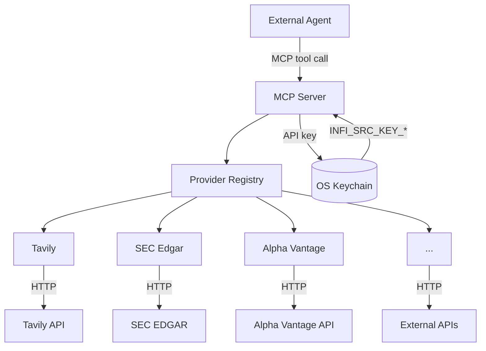
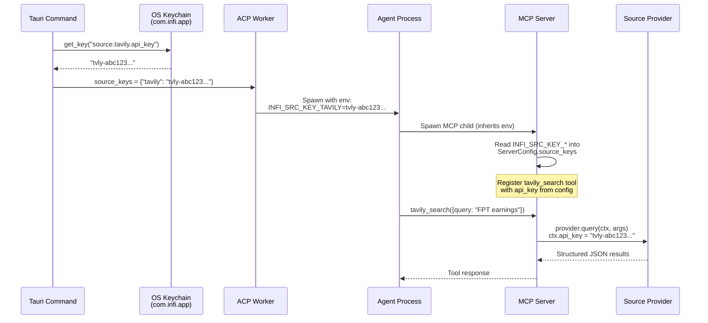
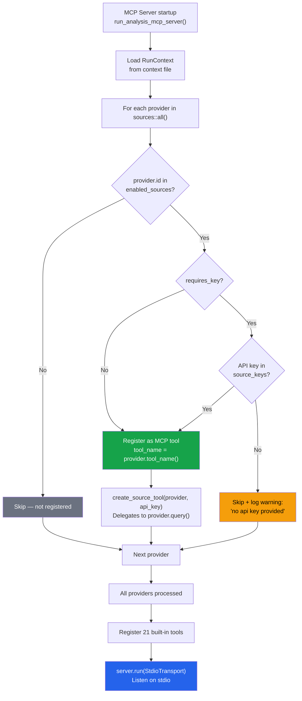
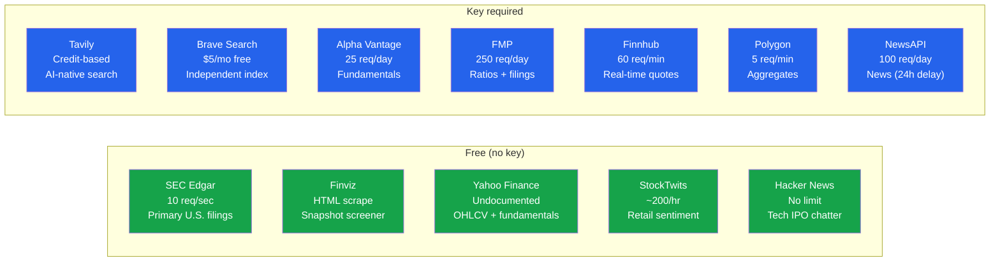

# Data Sources

The data sources subsystem (`src/infra/sources/`) provides a unified interface for fetching financial data from 12+ external providers. Each provider implements the `SourceProvider` trait and is automatically registered as an MCP tool that the agent can call during analysis.

## Key source files

| File | Purpose |
|---|---|
| `src/infra/sources/mod.rs` | Module root; re-exports core types, keychain helpers. |
| `src/infra/sources/provider.rs` | `SourceProvider` trait, `ProviderDescriptor`, `SourceError`, `ProviderCallContext`. |
| `src/infra/sources/registry.rs` | Provider registry: `all()`, `get()`, shared HTTP client. |
| `src/infra/sources/providers/mod.rs` | Sub-modules for all 12 providers; shared `send_with_retry` and `json_or_upstream` helpers. |
| `src/infra/keystore.rs` | OS keychain wrapper for API key storage. |

## Architecture



## The `SourceProvider` trait

```rust
#[async_trait]
pub trait SourceProvider: Send + Sync {
    fn descriptor(&self) -> ProviderDescriptor;
    fn tool_name(&self) -> String;          // defaults to "<id>_query"
    fn tool_description(&self) -> String;
    fn input_schema(&self) -> Value;        // JSON Schema for the MCP tool
    async fn query(&self, ctx: ProviderCallContext<'_>, args: Value) -> Result<Value, SourceError>;
}
```

Each provider declares its metadata via `ProviderDescriptor`:

```rust
pub struct ProviderDescriptor {
    pub id: &'static str,                   // e.g. "tavily", "sec_edgar"
    pub display_name: &'static str,         // e.g. "Tavily", "SEC EDGAR"
    pub category: SourceCategory,           // WebSearch, Filings, Fundamentals, etc.
    pub requires_key: bool,                 // Whether an API key is needed
    pub default_enabled: bool,              // Enabled by default in new analyses
    pub docs_url: &'static str,             // Provider documentation link
    pub key_acquisition_url: Option<&'static str>, // Where to get an API key
    pub rate_limit_hint: Option<&'static str>,     // Free-tier notice
    pub description: &'static str,          // Explanatory caption for Settings UI
}
```

### Source categories

| Category | Providers |
|---|---|
| `WebSearch` | Tavily, Brave Search |
| `Filings` | SEC Edgar |
| `Fundamentals` | Alpha Vantage, FMP |
| `MarketData` | Finnhub, Polygon, Yahoo Finance |
| `News` | NewsAPI |
| `Forums` | StockTwits, Hacker News |
| `Screener` | Finviz |

### Error handling

```rust
pub enum SourceError {
    MissingKey(&'static str),
    InvalidInput(String),
    Upstream { status: u16, message: String },
    RateLimited(&'static str),
    ParseFailed(String),
    Http(String),
    Shape,
}
```

## Provider registry

`registry.rs` maintains an ordered list of all built-in providers:

```rust
pub fn all() -> Vec<&'static dyn SourceProvider> { ... }
pub fn get(id: &str) -> Option<&'static dyn SourceProvider> { ... }
```

The shared HTTP client is built once with a 10-second timeout and the `Infi/<version>` user agent:

```rust
pub fn http_client() -> &'static reqwest::Client { ... }
```

Providers never instantiate their own HTTP client.

### Shared helpers (`providers/mod.rs`)

- `send_with_retry(build, provider_id)` — Sends an HTTP request with one automatic retry on 5xx or connection errors. Returns `SourceError::RateLimited` on 429.
- `json_or_upstream(resp)` — Parses JSON on success; maps non-2xx to `SourceError::Upstream` with a truncated (512-byte) error body to avoid leaking API keys in error messages.

## Providers

### Tavily

| Field | Value |
|---|---|
| ID | `tavily` |
| Category | WebSearch |
| Requires key | Yes |
| Default enabled | No |
| Tool name | `tavily_search` |
| Rate limit | Credit-based (1/basic, 2/advanced) |
| Endpoint | `https://api.tavily.com/search` |

AI-native web + news search. Supports `search_depth` (basic/advanced), `max_results`, `include_answer`, and `topic` (general/news/finance).

### Brave Search

| Field | Value |
|---|---|
| ID | `brave_search` |
| Category | WebSearch |
| Requires key | Yes |
| Default enabled | No |
| Tool name | `brave_search` |
| Rate limit | $5/mo free credits, ≤ 50 qps |
| Endpoint | `https://api.search.brave.com/res/v1` |

Independent web index. Supports `q`, `count`, `country`, and `freshness` (pd/pw/pm/py).

### SEC Edgar

| Field | Value |
|---|---|
| ID | `sec_edgar` |
| Category | Filings |
| Requires key | No |
| Default enabled | **Yes** |
| Tool name | `sec_edgar_lookup` |
| Rate limit | 10 req/sec, requires User-Agent with contact email |
| Endpoint | `https://data.sec.gov` |

Primary source for U.S. filings (10-K, 10-Q, 8-K). Uses `SEC_EDGAR_USER_AGENT` env var for compliance with SEC fair-access policy. Supports `submissions` (filing index) and `companyfacts` (XBRL financial concepts) endpoints by CIK.

### Alpha Vantage

| Field | Value |
|---|---|
| ID | `alpha_vantage` |
| Category | Fundamentals |
| Requires key | Yes |
| Default enabled | No |
| Tool name | `alpha_vantage_query` |
| Rate limit | 25 req/day free, 5 req/min |
| Endpoint | `https://www.alphavantage.co/query` |

Supports OVERVIEW, INCOME_STATEMENT, BALANCE_SHEET, CASH_FLOW, EARNINGS, TIME_SERIES_DAILY/WEEKLY/MONTHLY, GLOBAL_QUOTE.

### Financial Modeling Prep (FMP)

| Field | Value |
|---|---|
| ID | `fmp` |
| Category | Fundamentals |
| Requires key | Yes |
| Default enabled | No |
| Tool name | `fmp_query` |
| Rate limit | 250 req/day free |
| Endpoint | `https://financialmodelingprep.com/api/v3` |

Higher free quota than Alpha Vantage. Supports profile, quote, income-statement, balance-sheet-statement, cash-flow-statement, ratios.

### Finnhub

| Field | Value |
|---|---|
| ID | `finnhub` |
| Category | MarketData |
| Requires key | Yes |
| Default enabled | No |
| Tool name | `finnhub_query` |
| Rate limit | 60 req/min free |
| Endpoint | `https://finnhub.io/api/v1` |

Company profile, real-time quotes, curated company news feed.

### Polygon.io

| Field | Value |
|---|---|
| ID | `polygon` |
| Category | MarketData |
| Requires key | Yes |
| Default enabled | No |
| Tool name | `polygon_query` |
| Rate limit | 5 req/min free tier |
| Endpoint | `https://api.polygon.io` (overridable via `INFI_POLYGON_BASE_URL`) |

Aggregates and ticker reference data. Supports `aggregates` (OHLCV with multiplier/timespan/from/to) and `ticker_details`.

### NewsAPI

| Field | Value |
|---|---|
| ID | `newsapi` |
| Category | News |
| Requires key | Yes |
| Default enabled | No |
| Tool name | `newsapi_query` |
| Rate limit | 100 req/day dev, articles 24h+ old only |
| Endpoint | `https://newsapi.org/v2` |

Broad news aggregator. Free tier only returns articles at least 24 hours old.

### Finviz

| Field | Value |
|---|---|
| ID | `finviz` |
| Category | Screener |
| Requires key | No |
| Default enabled | No |
| Tool name | `finviz_query` |
| Rate limit | HTML scrape, cap a few req/min |
| Endpoint | `https://finviz.com` |

Community-favorite snapshot: valuation + profitability + technicals in one fetch. Parsed server-side from HTML to flat JSON using the `scraper` crate. Finviz's HTML can shift without notice.

### StockTwits

| Field | Value |
|---|---|
| ID | `stocktwits` |
| Category | Forums |
| Requires key | No |
| Default enabled | No |
| Tool name | `stocktwits_query` |
| Rate limit | ~200/hr unauthenticated |
| Endpoint | `https://api.stocktwits.com/api/2` |

Retail trader sentiment stream. Supports `symbol` (message stream) and `trending` endpoints. Signal quality varies; corroborate with other sources.

### Hacker News

| Field | Value |
|---|---|
| ID | `hacker_news` |
| Category | Forums |
| Requires key | No |
| Default enabled | No |
| Tool name | `hacker_news_query` |
| Rate limit | No published limit |
| Endpoint | `https://hacker-news.firebaseio.com/v0` |

Tech IPO and product chatter. Supports `topstories` and `item` endpoints.

### Yahoo Finance (unofficial)

| Field | Value |
|---|---|
| ID | `yahoo_finance` |
| Category | MarketData |
| Requires key | No |
| Default enabled | No |
| Tool name | `yahoo_finance_query` |
| Rate limit | Undocumented, may break |
| Endpoint | `https://query1.finance.yahoo.com/v8/finance/chart` |

Unofficial endpoint — no ToS agreement. Supports `chart` (OHLCV series) and `quoteSummary` (fundamental modules). Use only when licensed sources are unavailable.

## API key management (`keystore.rs`)

API keys are stored in the OS credential store (macOS Keychain, Windows Credential Manager, Linux Secret Service) under the service name `com.infi.app`. There is no plaintext file fallback.

```rust
pub fn get_key(account: &str) -> Result<Option<String>, KeystoreError>
pub fn set_key(account: &str, value: &str) -> Result<(), KeystoreError>
pub fn delete_key(account: &str) -> Result<(), KeystoreError>
pub fn has_key(account: &str) -> Result<bool, KeystoreError>
```

The account identifier follows the pattern `source.<provider_id>.api_key` (defined by `sources::key_account()`). On platforms where the keychain is unavailable (e.g., headless Linux without `secret-service`), `KeystoreError::Unavailable` is returned and the Settings UI renders the Data Sources section as read-only.

### Key injection flow

1. The Tauri command reads keys from the OS keychain for all enabled providers.
2. Keys are passed to the ACP worker as `source_keys: HashMap<String, String>`.
3. The worker injects them as `INFI_SRC_KEY_<ID_UPPER>` environment variables on the MCP child process.
4. The MCP server reads these env vars at startup and stores them in `ServerConfig.source_keys`.
5. When a source tool is called, the key is passed to the provider via `ProviderCallContext { api_key }`.

The MCP child **never** touches the OS keychain directly.



## Provider enable/disable

Providers are enabled or disabled per analysis run. The MCP server checks `enabled_sources` from the run context:

```rust
for provider in sources::all() {
    let d = provider.descriptor();
    if !enabled_sources.iter().any(|id| id == d.id) {
        continue;
    }
    // Register as MCP tool...
}
```

Providers with `requires_key: true` are skipped if no API key is available, even if enabled.

### Provider registration flowchart



## Provider personality matrix

Each provider has different characteristics. The MCP server respects these differences rather than pretending all sources are equal.



## Tests

The registry module includes tests for:
- **Unique provider IDs** — no duplicates in the registry.
- **Snake-case IDs** — all provider IDs are lowercase alphanumeric with underscores.
- **Unique tool names** — no duplicate MCP tool names across providers.

## Related pages

- [ACP Integration](acp-integration.md) — Providers are registered as MCP tools by the ACP MCP server.
- [Database](database.md) — Source metadata and metrics are persisted here.
