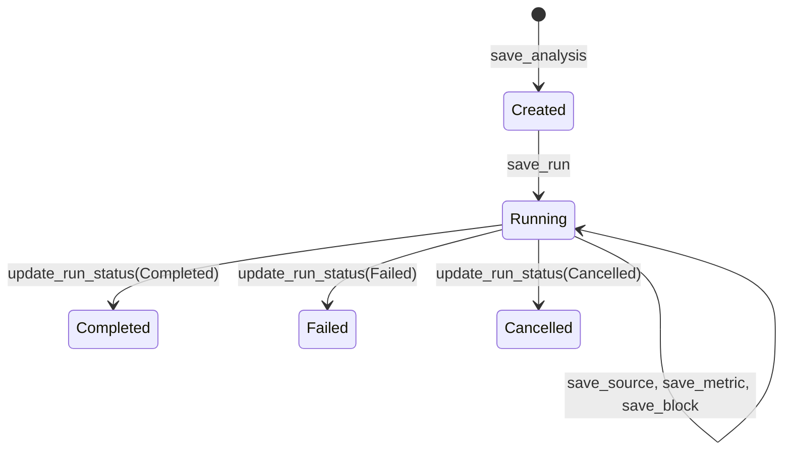

# Database

The database subsystem (`src/infra/db/mod.rs`, ~5200 lines) is the single persistence layer for the entire application. It stores analyses, agent runs, financial data, portfolio holdings, and all report artifacts in a local SQLite file.

## Key source files

| File | Purpose |
|---|---|
| `src/infra/db/mod.rs` | All database logic: schema, migrations, CRUD operations, report assembly, portfolio management, and tests. |

## The `Database` struct

```rust
#[derive(Clone)]
pub struct Database {
    conn: Arc<Mutex<Connection>>,
    path: PathBuf,
}
```

`Database` wraps a single `rusqlite::Connection` behind `Arc<Mutex<...>>`. This allows the struct to be cloned across threads (Tauri commands, ACP worker, MCP server child process) while serializing access to the connection. The `lock_conn()` method converts a poisoned mutex into a recoverable error rather than panicking.

### Path resolution

The database file path is resolved in order:

1. `INFI_DB_PATH` environment variable (explicit override)
2. Platform-specific default:
   - **macOS**: `~/Library/Application Support/Infi/db.sqlite`
   - **Windows**: `%APPDATA%/Infi/db.sqlite`
   - **Linux**: `$XDG_DATA_HOME/infi/db.sqlite` or `~/.local/share/infi/db.sqlite`
3. Fallback: `.infi/db.sqlite` in the current working directory

### Transaction helper

```rust
pub(crate) fn with_tx<T>(
    &self,
    f: impl FnOnce(&rusqlite::Transaction<'_>) -> rusqlite::Result<T>,
) -> Result<T>
```

Runs a closure inside a SQLite transaction. Commits on `Ok`, rolls back on `Err` or panic. Used for any multi-write operation that must be atomic (e.g., portfolio CSV import).

## Initialization and migrations

The `init()` method runs on every `Database::open()` call:

1. **PRAGMAs** — enables foreign keys, WAL journal mode, `synchronous = NORMAL`, 5-second busy timeout, and in-memory temp store.
2. **CREATE TABLE IF NOT EXISTS** — creates all 20+ tables idempotently.
3. **CREATE INDEX IF NOT EXISTS** — creates indexes on all `run_id` foreign keys plus portfolio-related columns.
4. **Schema migrations** — uses a try-and-swallow pattern for idempotent column additions and removals:
   - `ALTER TABLE ... DROP COLUMN` silently ignores errors for columns that don't exist.
   - `ALTER TABLE ... ADD COLUMN` silently ignores duplicate-column errors.
   - Data migrations (e.g., rewriting retired block kinds, backfilling new columns) run with `UPDATE` statements.

This approach avoids a formal migration version table. The tradeoff is that every migration must be idempotent.

## Schema

### Core analysis tables

| Table | Purpose |
|---|---|
| `analyses` | Top-level analysis record: title, user prompt, intent, status, optional portfolio link. |
| `analysis_runs` | Individual agent runs per analysis: agent ID, model, prompt text, status, timestamps, error. |
| `research_plans` | Agent-submitted research plan: intent, summary, decision criteria, planned checks. |
| `entities` | Resolved tickers/companies/ETFs/sectors: symbol, name, exchange, asset type, confidence. |
| `sources` | Cited sources: title, URL, publisher, type, reliability rating, verification status. |
| `metrics` | Numeric metric snapshots: value, unit, period, as-of date, prior value, change %. |
| `structured_artifacts` | Comparison matrices, KPI grids, charts: columns, rows, series, evidence IDs. |
| `analysis_blocks` | Report sections: kind (thesis, risks, financials, etc.), body markdown, confidence, importance. |
| `final_stances` | Agent's final stance: bullish/bearish/neutral/mixed, horizon, confidence, key reasons. |
| `projections` | Forward-looking projections per entity: scenarios (bull/base/bear), methodology, assumptions. |
| `counter_theses` | Steelman opposing cases: stance against, residual probability. |
| `uncertainty_entries` | Unresolved questions: why it matters, whether blocking. |
| `methodology_note` | Research approach, frameworks, data windows, known limitations. |
| `decision_criterion_answers` | Per-criterion verdicts linking back to the research plan. |
| `metric_explanations` | Hover tooltips: definition, meaning, value interpretation, good thresholds. |

### Portfolio tables

| Table | Purpose |
|---|---|
| `portfolios` | Portfolio record: name, base currency. |
| `portfolio_accounts` | Accounts within a portfolio: institution, account type. |
| `portfolio_positions` | Current holdings: symbol, quantity, price, market value, cost basis. |
| `portfolio_transactions` | Transaction history from CSV imports: trade date, action, amounts. |
| `portfolio_import_batches` | Import metadata: source name, kind, row counts, warnings. |

### Portfolio analysis tables

| Table | Purpose |
|---|---|
| `holding_reviews` | Per-holding stance (keep/trim/add/watch/exit), rationale, confidence. |
| `allocation_reviews` | Allocation breakdown by dimension (asset class, sector, geography). |
| `portfolio_risks` | Factor exposures, macro sensitivities, single-name and tail risks. |
| `rebalancing_suggestions` | Current vs. suggested weights, scenarios, caveats. |
| `portfolio_scenario_analyses` | Bull/base/bear portfolio outcomes, stress cases. |
| `portfolio_expected_return_models` | Weighted expected-return inputs, correlation assumptions. |

### Operational tables

| Table | Purpose |
|---|---|
| `run_progress` | Streaming progress events (log, tool calls, message deltas) for live UI updates. |

## Key operations

### Analysis lifecycle



- `save_analysis()` — INSERT OR REPLACE into `analyses`.
- `save_run()` — INSERT OR REPLACE into `analysis_runs`.
- `update_run_status()` — Updates run status and sets `completed_at` for terminal states.
- `delete_analysis()` — Cascading delete (foreign keys with `ON DELETE CASCADE`).

### Report assembly

`get_report()` is the main read path. It:

1. Loads the `Analysis` record.
2. Selects the active run (explicit override > `active_run_id` > most recent).
3. Loads all sub-sections: research plan, entities, sources, metrics, artifacts, blocks, stance, projections, counter-theses, uncertainties, methodology, criterion answers, explanations.
4. For portfolio-intent analyses, additionally loads holding reviews, allocation reviews, portfolio risks, rebalancing suggestions, scenario analyses, and expected-return models.
5. For non-portfolio intents, returns empty vecs for portfolio sections even if rows exist.

### Portfolio management

- `create_portfolio()` / `rename_portfolio()` / `delete_portfolio()` — basic CRUD.
- `import_portfolio_csv()` — Parses CSV rows inside a transaction: upserts portfolio and account, handles position-snapshot replacement, deduplicates transactions by `row_fingerprint`, and produces import warnings.
- `get_portfolio_detail()` — Assembles full portfolio with accounts, positions, transactions, derived holdings, and currency totals.
- Holdings are derived by merging positions and transactions, sorted by `allocation_pct` descending.

### Finalization validation

`validate_finalization()` checks that a run has all required artifacts before marking it complete:

- Research plan, methodology note, and final stance must exist.
- Required block kinds depend on intent (e.g., `single_equity` needs thesis, risks, financials, valuation, catalysts).
- At least one source with reliability > `low` must exist.
- For directional stances, a counter-thesis is required.
- Decision criterion answers must match the plan's criteria.
- For `single_equity` and `compare_equities`, at least one projection is required.
- For `portfolio`, allocation review, portfolio risk, scenario analysis, and expected-return model are required.

Returns a `Vec<String>` of validation errors (empty = valid).

## Test patterns

Tests use `Database::open_at(PathBuf::from(":memory:"))` for in-memory databases or `tempfile::tempdir()` for file-backed tests. Common helper functions in the `#[cfg(test)]` module:

- `seed_run()` — Creates a minimal analysis + run.
- `save_source()` / `save_source_with()` — Inserts a source with configurable reliability.
- `save_plan()`, `save_block()`, `save_stance()`, `save_methodology()`, `save_criterion_answers()` — Populate the required artifacts for finalization testing.
- `valid_scenarios()` — Returns a bull/base/bear scenario set with probabilities summing to 1.0.

Migration tests use file-backed databases to verify idempotency: open once, close, reopen, and assert columns exist.

## Related pages

- [ACP Integration](acp-integration.md) — The MCP server writes directly to this database.
- [Prompts](prompts.md) — Reads analysis data to render prompt templates.
