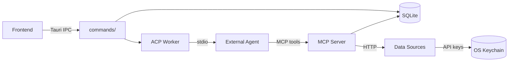

# Backend Systems

Infi's Rust backend is organized into several subsystems under `src/`. Each handles a distinct responsibility in the analysis lifecycle — from persisting data to spawning AI agents to fetching market data from external providers.

| System | Description |
|---|---|
| [Database](database.md) | SQLite persistence for analyses, runs, entities, metrics, projections, portfolios, and all report artifacts. |
| [ACP Integration](acp-integration.md) | Spawns external coding agents (Codex, Claude Code, Gemini, etc.) via the Agent Client Protocol and manages the agent lifecycle. |
| [Data Sources](data-sources.md) | 12+ financial data providers (Alpha Vantage, Finnhub, SEC Edgar, Yahoo Finance, etc.) with a unified `SourceProvider` trait and OS-keychain API key management. |
| [Prompts](prompts.md) | Handlebars-templated prompt system for analysis, portfolio review, and the explanation-pass workflow. |

## Cross-cutting modules

| Module | Path | Description |
|---|---|---|
| App config | `src/infra/app_config.rs` | Loads user settings (custom agent command, source preferences) from disk. |
| Keystore | `src/infra/keystore.rs` | OS keychain wrapper for storing provider API keys securely. |
| Shell utilities | `src/infra/shell.rs` | Binary resolution, process-group management, Windows console suppression. |
| Progress events | `src/infra/progress.rs` | Event payload types streamed from the ACP worker to the Tauri frontend. |
| CSV parser | `src/infra/csv_parser.rs` | Portfolio CSV import parsing and normalization. |
| Price history | `src/infra/price_history.rs` | Historical price fetching for portfolio valuation. |

## Data flow overview

