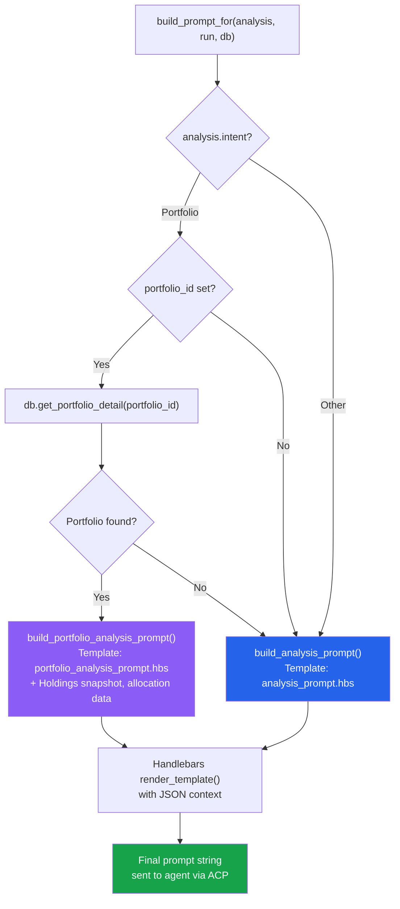
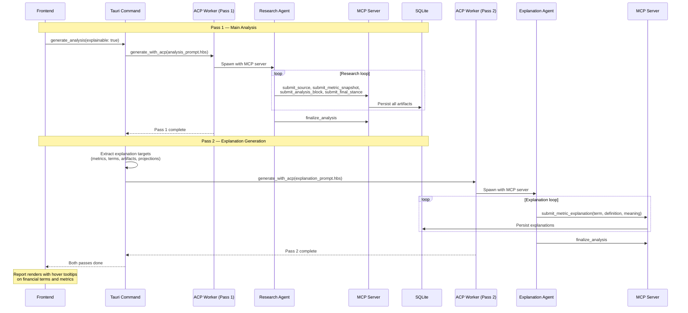
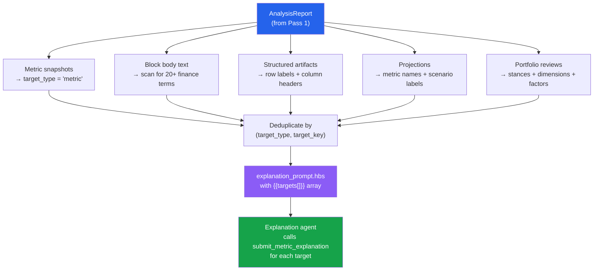

# Prompts

The prompt subsystem (`src/prompts.rs` + `.hbs` templates) is responsible for rendering the instructions that the external agent receives at the start of an analysis run. It uses Handlebars templates populated with domain data from the database.

## Key source files

| File | Purpose |
|---|---|
| `src/prompts.rs` | Prompt building logic (~920 lines): template rendering, explanation target extraction, finance-term detection. |
| `src/analysis_prompt.hbs` | Main analysis prompt template (single-equity, comparison, sector, watchlist, etc.). |
| `src/portfolio_analysis_prompt.hbs` | Portfolio-level analysis prompt template. |
| `src/explanation_prompt.hbs` | Explanation-pass prompt template for generating hover tooltips. |

## Template system

Infi uses the `handlebars` Rust crate with `include_str!()` to embed templates at compile time. Each template receives a JSON context object and produces the final prompt string that is sent to the agent via ACP.

```rust
let template = include_str!("analysis_prompt.hbs");
let handlebars = Handlebars::new();
let prompt = handlebars.render_template(template, &json!({ ... }))?;
```

No runtime file I/O is needed — templates are compiled into the binary.

## Prompt selection

`build_prompt_for()` selects the appropriate template based on the analysis intent:

```rust
pub fn build_prompt_for(analysis: &Analysis, run: &RunContext, db: &Database) -> Result<String> {
    if analysis.intent == AnalysisIntent::Portfolio
        && let Some(portfolio_id) = analysis.portfolio_id.as_deref()
        && let Some(detail) = db.get_portfolio_detail(portfolio_id)?
    {
        return build_portfolio_analysis_prompt(run, &detail);
    }
    build_analysis_prompt(run)
}
```

- **Portfolio intent** → `portfolio_analysis_prompt.hbs` (with portfolio snapshot data).
- **All other intents** → `analysis_prompt.hbs`.

### Template selection flowchart



## Two-pass analysis system

Infi uses a two-pass architecture to separate research depth from accessibility. Pass 1 produces the structured report. Pass 2 generates plain-language explanations for financial terms and metrics.



### Explanation target extraction

After Pass 1 completes, `explanation_targets_from_report()` scans the finished `AnalysisReport` and extracts every explainable element:



## Main analysis prompt (`analysis_prompt.hbs`)

This is the primary prompt for single-equity, comparison, sector, watchlist, and general-research analyses. It is structured into several sections:

### Template variables

| Variable | Source |
|---|---|
| `{{analysis_id}}` | Run context |
| `{{run_id}}` | Run context |
| `{{user_prompt}}` | Run context |
| `{{agent_id}}` | Run context |

### Prompt structure

1. **Role** — "You are Infi, a research analyst using ACP."
2. **Core policy** — Research-only, no personalized financial advice. Use all available tools. Submit output through MCP tools, not markdown.
3. **Tool contract** — Required reasoning fields are not optional. Out-of-range values reject calls.
4. **Workflow** — 9-step numbered workflow:
   1. `submit_research_plan` with intent, decision criteria, planned checks.
   2. `submit_methodology_note` once.
   3. `submit_entity_resolution` for every entity.
   4. Research using available tools.
   5. `submit_source` for every cited source.
   6. `submit_metric_snapshot` for numeric claims.
   7. `submit_structured_artifact` for comparison matrices, KPI grids, charts.
   8. `submit_analysis_block` to build the report (with counter-thesis and uncertainty ledger).
   9. `submit_final_stance` → `submit_projection` → `submit_decision_criterion_answer` → `finalize_analysis`.
5. **Decision frame** — Translate the request into 3-6 decision criteria.
6. **Required blocks** — Always include thesis and risks; add financials, valuation, catalysts for single equity; peer_comparison for comparisons.
7. **Required artifacts** — Specifies which structured artifact kinds to submit based on intent.
8. **Projection rules** — Required for single_equity and compare_equities; must include bull/base/bear scenarios with probabilities summing to 1.0.
9. **Counter thesis** — Required before directional stances; residual probability ≥ 0.10.
10. **Uncertainty** — Blocking uncertainties cap stance confidence at 0.6.
11. **Block quality** — Specific formatting rules: concise titles, markdown body, evidence IDs, `[[N]]` number highlighting.
12. **Final stance** — Required fields: stance, horizon, confidence, summary, key reasons, what would change.
13. **Freshness** — Metrics must be within 12 months for directional stances.

## Portfolio analysis prompt (`portfolio_analysis_prompt.hbs`)

Extends the main prompt for portfolio-level analysis. Additional template variables:

| Variable | Source |
|---|---|
| `{{portfolio.name}}` | Portfolio record |
| `{{portfolio.base_currency}}` | Portfolio record |
| `{{snapshot.as_of}}` | Most recent import batch |
| `{{snapshot.total_value}}` | Sum of holding market values |
| `{{snapshot.count}}` | Number of holdings |
| `{{holdings[]}}` | Array of `{entity_id, symbol, market, name, quantity, price, market_value, weight_pct}` |

### Additional workflow steps

The portfolio prompt adds these steps beyond the base workflow:

- **Step 9**: `submit_holding_review` for each holding ≥ 2% weight (keep/trim/add/watch/exit stance).
- **Step 10**: `submit_allocation_review` once (dimensions: asset class, sector, geography, currency).
- **Step 11**: `submit_portfolio_risk` once (factor exposures, macro sensitivities, tail risks).
- **Step 12**: `submit_portfolio_scenario_analysis` once (bull/base/bear portfolio outcomes, stress cases).
- **Step 13**: `submit_portfolio_expected_return_model` once (weighted inputs, correlation assumptions).
- **Step 14**: `submit_rebalancing_suggestion` if warranted (scenarios, not instructions).

### Portfolio-specific constraints

- Rebalancing guidance must be framed as non-prescriptive scenarios, not instructions.
- Do not invent tax-regime or country-specific rules.
- The portfolio-level stance evaluates overall risk/return posture, not a single holding.

## Explanation prompt (`explanation_prompt.hbs`)

A second-pass prompt that runs after the main analysis to generate hover-to-explain tooltips. This is a separate ACP run with a different prompt.

### Template variables

| Variable | Source |
|---|---|
| `{{analysis_id}}` | Run context |
| `{{run_id}}` | Run context |
| `{{user_prompt}}` | Run context |
| `{{targets[]}}` | Extracted from the completed report |

Each target includes: `target_type`, `target_key`, `display_name`, `metric_name`, `numeric_value`, `unit`, `as_of`.

### Prompt structure

1. **Role** — "You are Infi's explanation generator."
2. **Instructions** — For every target, call `submit_metric_explanation` exactly once with: `definition`, `meaning`, `value_interpretation`, `good_threshold`, `current_value_assessment`.
3. **Targets list** — Rendered from the extracted targets.
4. **Style guide** — Concise, plain language, reference actual values, no invented thresholds.

The agent calls only `submit_metric_explanation` and `finalize_analysis` — no other write tools.

## Explanation target extraction

`explanation_targets_from_report()` scans a completed `AnalysisReport` and extracts all explainable targets:

### Metric targets
Every `MetricSnapshot` in the report becomes a target with `target_type = "metric"`.

### Term targets
The report's block bodies are scanned for finance terms using a hardcoded dictionary of 20+ terms:

```rust
const FINANCE_TERMS: &[(&str, &[&str])] = &[
    ("pe", &["P/E", "P/E ratio", "price to earnings"]),
    ("casa", &["CASA", "CASA ratio"]),
    ("eps", &["EPS", "earnings per share"]),
    ("roe", &["ROE", "return on equity"]),
    // ... 20+ more
];
```

Each detected term becomes a target with `target_type = "term"`.

### Artifact targets
Structured artifacts contribute targets for:
- Row labels with `metric` or `factor` keys (e.g., KPI grid rows, ratio snapshot rows).
- Column headers (each column label becomes a target).

### Projection targets
Each projection contributes:
- The projected metric name.
- Each scenario (bull/base/bear) label.

### Portfolio targets
- **Holding review stance labels** — each review's stance becomes a target.
- **Allocation dimensions** — each dimension in allocation reviews.
- **Risk factor exposures** — each factor in portfolio risks.
- **Rebalancing row labels** — each row in rebalancing suggestions.

### Deduplication
Targets are deduplicated by `(target_type, target_key)` using a `HashSet`. Keys are normalized via `normalize_explanation_key()`:

```rust
pub fn normalize_explanation_key(value: &str) -> String {
    value.trim().to_ascii_lowercase()
        .chars().map(|ch| if ch.is_ascii_alphanumeric() { ch } else { '_' })
        .collect::<String>()
        .split('_').filter(|p| !p.is_empty()).collect::<Vec<_>>().join("_")
}
```

This matches the TypeScript implementation in `frontend/src/features/report-viewer/explanation-utils.ts`.

## Key source files

| File | Lines | Purpose |
|---|---|---|
| `src/prompts.rs` | ~920 | All prompt building and target extraction logic. |
| `src/analysis_prompt.hbs` | ~300 | Main analysis prompt template. |
| `src/portfolio_analysis_prompt.hbs` | ~280 | Portfolio analysis prompt template. |
| `src/explanation_prompt.hbs` | ~80 | Explanation pass prompt template. |

## Tests

The `prompts.rs` test module includes:
- `explanation_targets_include_metrics_and_detected_terms()` — Verifies that metrics and CASA/NIM terms are extracted from a fixture report.
- Finance-term detection is tested against block body text containing specific terminology.

## Related pages

- [ACP Integration](acp-integration.md) — The rendered prompt is sent to the agent via ACP.
- [Database](database.md) — Report data is read from the DB to populate templates.
